BeamDet
=======

Детектор пучка BeamDet
----------------------

Задача детектора пучка состоит в нахождении для каждого налетающего иона точки и направления импульса на мишени, идентификации иона, определении его кинетической энергии.

Детектор состоит из двух пластин ToF, четырех плоскостей (2-х станций) MWPC и мишени.

MWPC устроен следующим образом. Перпендикулярные пучку стенки из каптона толщиной 12.5 микрон на расстоянии 82 мм друг от друга.
Между стенками - газ CF4, снаружи от каптоновых стенок - вакуум. В середине газового объема расположена сборка из 2-х MWPC.
Катоды параллельны стенкам и выполнены из сплошного алюминия толщиной 5 мкм.

Последовательность в направлении пучка такая: алюминий 5 мкм, газ 6 мм, алюминий 5 мкм, газ 4 мм, алюминий 5 мкм, газ 6 мм, алюминий 5 мкм.

В серединах зазоров 6 мм расположены проволочки. В одном зазоре - вертикальные, в другом - горизонтальные.

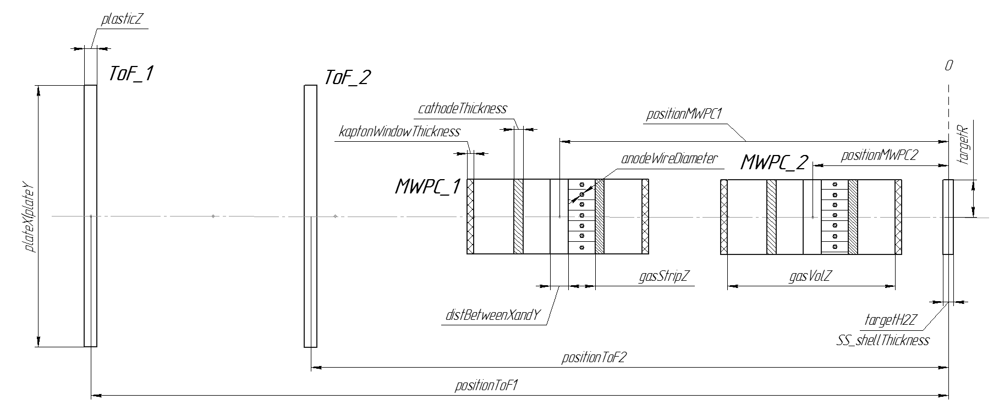

       Рисунок N. Геометрия BeamDet.

Газ разбит на активные вытянутые объемы так, что в центре каждого активного объема газа - проволочка из вольфрама.

Параметры полосок газа: X = 0.125 см, Y = 5 см, Z = 0.6 см.

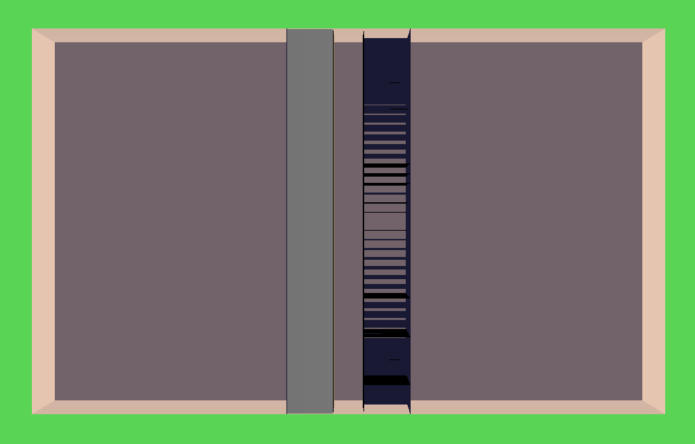

       Рисунок N. Геометрия многопроволочных камер в ROOT.

В классе ERBeamDet осуществлена возможность создания геометрии симуляции без использования отдельного макроса. Для этого переопределен виртуальный метод void ERBeamDet::ConstructGeometry(), внутри которого вызывается метод ERBeamDetSetup::ConstructGeometry(), который по параметрам, полученным из базы данных компонентов, создает геометрию и записывает ее во временный файл /geometry/beamdet.temp.root.

Описание отдельных компонентов геометрии выполняется внутри XML-файла параметров, который располагается в /db/BeamDet директории проекта https://github.com/ExpertRootGroup/er/tree/beamdet/db/BeamDet. В нем, каждого типа составной части детектора указывается ее уникальный идентификатор(id) и конкретные значения атрибутов геометрии:

::

  <?xml version = "1.0" encoding = "utf-8" ?>
  <!DOCTYPE BeamDetParts SYSTEM "equip.dtd">
  <BeamDetParts>
    <ToFTypes>
      <ToF id = "ToF1">
        <plasticGeometry X = "100" Y = "100" Z = "0.01"/>
        <plasticMedia>BC408</plasticMedia>
      </ToF>
    </ToFTypes>
    <MWPCTypes>
      <MWPC id = "MWPC1">
        <gasVolGeometry   X = "5."    Y = "5." Z = "8.2"/>
        <gasStripGeometry X = "0.125" Y = "5." Z = "0.6"/>
        <distBetweenXandYStrips>1</distBetweenXandYStrips>
        <cathodeThickness>0.005</cathodeThickness>
        <kaptonWindowThickness>0.00125</kaptonWindowThickness>
        <anodeWireDiameter>0.002</anodeWireDiameter>
        <kaptonWindowMedia>kapton</kaptonWindowMedia>
        <cathodeMedia>aluminium</cathodeMedia>
        <anodeWireMedia>tungsten</anodeWireMedia>
        <gasMedia>CF4_CH4</gasMedia>
      </MWPC>
    </MWPCTypes>
  </BeamDetParts>

Структура XML-файла параметров определяется в DTD(Doсument Type Definition)-файле. В нем перечисляются все допустимые наименования узлов документа, их атрибуты и вложенные узлы.

::

  <!ELEMENT BeamDetParts (ToFTypes, MWPCTypes)>
  <!ELEMENT ToFTypes (ToF+)>
  <!ELEMENT ToF (plasticGeometry, plasticMedia)>
  <!ATTLIST ToF
    id ID #REQUIRED
  >
  <!ELEMENT plasticGeometry EMPTY>
  <!ATTLIST plasticGeometry
    X CDATA #REQUIRED
    Y CDATA #REQUIRED
    Z CDATA #REQUIRED
  >
  <!ELEMENT plasticMedia (#PCDATA)>

  <!ELEMENT MWPCTypes (MWPC+)>
  <!ELEMENT MWPC (gasVolGeometry,gasStripGeometry, distBetweenXandYStrips, cathodeThickness, kaptonWindowThickness, anodeWireDiameter, kaptonWindowMedia, cathodeMedia, anodeWireMedia, gasMedia)>
  <!ATTLIST MWPC
    id ID #REQUIRED
  >
  <!ELEMENT gasVolGeometry EMPTY>
  <!ATTLIST gasVolGeometry
    X CDATA #REQUIRED
    Y CDATA #REQUIRED
    Z CDATA #REQUIRED
  >
  <!ELEMENT gasStripGeometry EMPTY>
  <!ATTLIST gasStripGeometry
    X CDATA #REQUIRED
    Y CDATA #REQUIRED
    Z CDATA #REQUIRED
  >
  <!ELEMENT distBetweenXandYStrips (#PCDATA)>
  <!ELEMENT cathodeThickness (#PCDATA)>
  <!ELEMENT kaptonWindowThickness (#PCDATA)>
  <!ELEMENT anodeWireDiameter (#PCDATA)>
  <!ELEMENT kaptonWindowMedia (#PCDATA)>
  <!ELEMENT cathodeMedia (#PCDATA)>
  <!ELEMENT anodeWireMedia (#PCDATA)>
  <!ELEMENT gasMedia (#PCDATA)>

В случае несоответствия файла с данными об оборудовании описанной DTD-схеме, выполнение программы завершится ошибкой.

Редактировать XML-файл можно в MS Excel, либо напрямую изменяя параметры внутри XML-файла.

Редактирование файла параметров в MS Excel
""""""""""""""""""""""""""""""""""""""""""

Для изменения параметров в Excel, файл должен иметь заранее подгруженную в него XML-карту. В репозитории проекта лежат именно такие файлы https://github.com/ExpertRootGroup/er/tree/beamdet/db/BeamDet. Для редактирования нужно открыть файл с разрешением .xlsx. В нем два листа: один под ToF, другой под MWPC. Каждая строка таблицы - новый тип MWPC или ToF. Для того, чтобы класс настроек BeamDet корректно разобрал данные, необходимо заполнять все ячейки в строках таблицы.
Сохранить результаты правки нужно в двух форматах:

	1) Обычное сохранение .xlsx – файла.
	2) Сохранение в формате XML, так как именно с ним работает метод создания геометрии. «Файл» -> «Сохранить как» -> «Тип файла» выбрать формат «XML-данные».

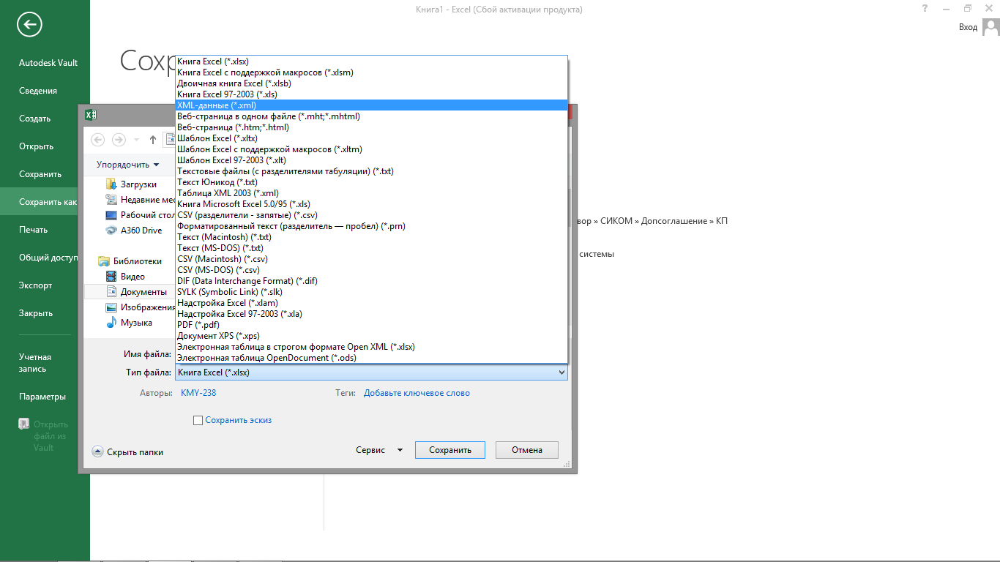

       Рисунок N. Сохранение параметров.

Если требуется создать файл редактирования XML-данных с нуля, необходим заранее сформированный xml-файл параметров.

Работа с внешними XML-даными в Excel происходит во вкладке "Разработчик".

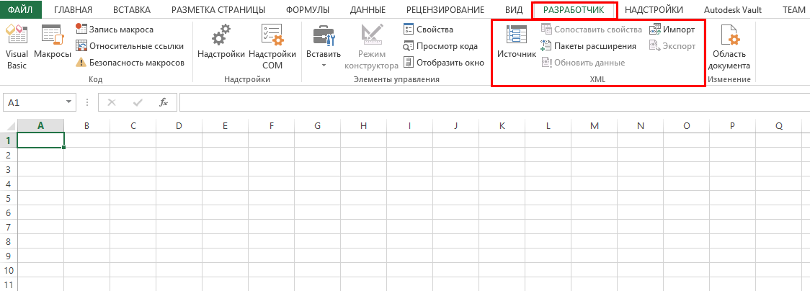

       Рисунок N. Вкладка "Разработчик".

Если вкладка "Разработчик" недоступна, выполните следующие действия, чтобы открыть ее.
В Excel 2010, 2013 и 2016:

	a. Выберите Файл > Параметры.
	b. Щелкните категорию Настроить ленту.
	c. В разделе Основные вкладки установите флажок Разработчик и нажмите кнопку ОК.

В Excel 2007:
	a. Нажмите кнопку Microsoft Office, а затем — кнопку Параметры Excel.
	b. Выберите категорию Основные.
	c. В разделе Основные параметры работы с Excel установите флажок Показывать вкладку "Разработчик" на ленте и нажмите кнопку ОК.

Во вкладке «Разработчик» открываем пункт «Источник».
В появившемся поле «Источник XML» открываем «Карты XML»->"Добавить" и находим заранее созданный xml-файл. Нажимаем ОК.  В поле «Источник XML» появилась карта со структурой файла.

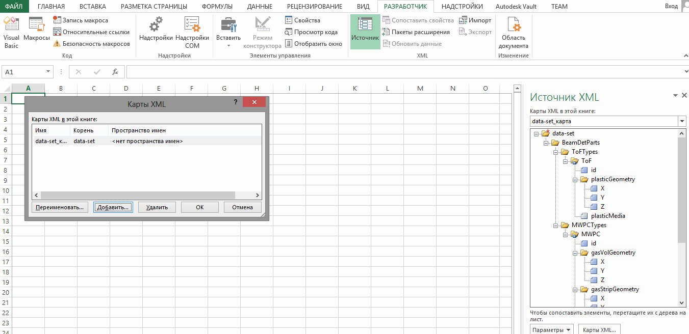

       Рисунок N. Загрузка карты XML-файла.

Теперь, чтобы добавить таблицу для редактирования, сопоставляем поля данных XML-файла и Excel таблицы. Кликаем правой кнопкой мыши по папке с синей стрелкой(ToF) и в выпавшем меню пункт выбираем «Сопоставить». Выбираем ячейку, с которой начнется таблица.
Те же действия выполняются для сопоставления MWPC-карты.

Для обновления данных таблиц в соответствие с xml-файлом: нажать правой кнопкой мыши на таблицу в контектном меню через "XML"->"Импорт" выбрать xml-файл. 

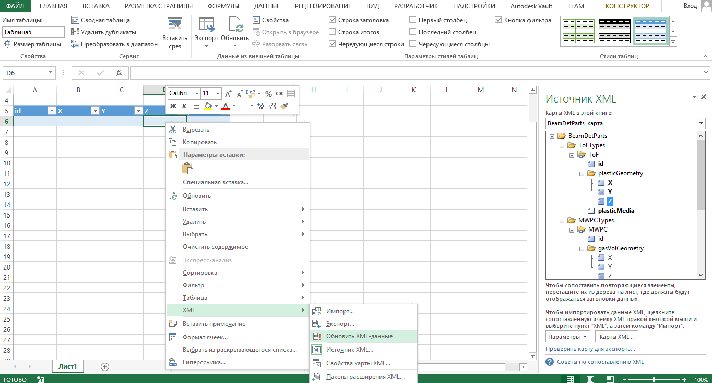

       Рисунок N. Загрузка данных в таблицу.

Более подробно о работе с форматом XML в Excel можно узнать по ссылке: https://support.office.com/ru-ru/article/%D0%9E%D0%B1%D0%B7%D0%BE%D1%80-XML-%D0%B2-Excel-f11faa7e-63ae-4166-b3ac-c9e9752a7d80

Создание геометрии через Setup-класс
""""""""""""""""""""""""""""""""""""

Для создания геометрии при помощи интерфейсов класса настроек ERBeamDetSetup необходимо инициализировать объект этого класса внутри макроса симуляции и передать название файла с базой данных частей детектора.

::

  ERBeamDetSetup* setup = ERBeamDetSetup::Instance();
  setup->SetXmlParametersFile("equip.xml");

Выбор конкретных элементов детектора осуществляется с помощью интерфейсов:

::

  setup->AddMWPC("MWPC1", -40.);
  setup->AddMWPC("MWPC1", -8.);
  setup->AddToF("ToF1",-1550.);
  setup->AddToF("ToF2",-50.);

AddMWPC("MWPC1", -40.) первым аргументом определяется id MWPC-камеры из файла настроек, а вторым расстояние до мишени. Аналогично работает AddMWPC.

Материалы
"""""""""
Материал пластиков Tof:

::

  BC408     2  1.00794  12.0107  1.  6.  1.032  0.0764  0.916
            1  1  20.  .001
            0

Материалы MWPC камер:

::

  aluminium 1  26.98 13. 2.7
            0  1  20.  .001

  kapton   -4  14.006  12.011  1.008  16. 7. 6. 1. 8. 1.42 2 22 10 5
            0  0  20.  .001
            0

  tungsten  1  183.84  74.  19.3
            0  1  20.  .001
            0

  CF4_CH4   -2  12.01 1.008  6.  1.  2.7e-3  4  10
            1  1  20.  .001

Модель детектора имеет следующее дерево объемов:

::

  cave
    BeamDet
      plastic
      MWPC
        MWPCVol
          gasPlane
            gasStrip
              anodeWire

Симуляция
---------

Симуляция реализована в классах: ERBeamDet, ERBeamDetMWPCPoint, ERBeamDetToFPoint, ERBeamDetTargetPoint.

В результате разыгрывания событий, происходящих внутри детектора, формируются три типа поинтов: ERBeamDetToFPoint, ERBeamDetMWPCPoint, ERBeamDetTargetPoint.

Среди всего множества параметров, получаемых в деревьях по итогам симуляции, наиболее важными и используемыми на дальнейших этапах обработки результатов для ERBeamDetToFPoint являются:

 * fTime  - момент времени начала формирования поинта
 * fEloss - энерговыделение в поинте
 * fToFNb - номер пластины ToF

для ERBeamDetMWPCPoint:

 * fEloss - энерговыделение в поинте
 * fMWPCNb - номер станции MWPC
 * fPlaneNb - номер массива проволочек
 * fWireNb - номер проволочки в массиве

для ERBeamDetTargetPoint:

 * fPx, fPy, fPz - проекции импульса в момент попадания в мишень
 * fX, fY, fZ - координаты попадания в мишень

На данном этапе разработки программы в MWPC учтено рождение дельта-электронов, следовательно ненулевой размер области ионизации, в том числе расползание на соседние проволочки. Неучтенные эффекты в MWPC: снижение отклика, когда ионизация имеет место вблизи проволочки, диффузия ионизационных электронов. Формирование поинтов на проволочках внутри MWPC происходит при транспорте частицы через полоски газа. Т.е сигнал на проволочке собирается с некоторого чувствительного объема.

В ToF тушение сцинтилляции в зависимости от плотности ионизации (закон Биркса) учтено, но не валидированно для конкретного пластика.

Мишень введена в геометрию как чувствительный объем для проверки качества восстановления распределения координат и направлений импульса на мишени на этапе реконструкции.

Для корректного определения параметров fMWPCNb(номер станции), fMWPCPlaneNb(номер массива прямоугольных газовых объемов), fMWPCWireNb(номер проволочки) нужно внимательно следить за номерами объемов в иерархии.

::

  if(volName.Contains("gasStrip"))
  {
    gMC->CurrentVolOffID(0, fMWPCWireNb);
    gMC->CurrentVolOffID(1, fMWPCPlaneNb);
    gMC->CurrentVolOffID(3, fMWPCNb);
    AddMWPCPoint();
  }

Здесь, для того чтобы получить номер MWPC станции, необходимо подняться на три уровня иерархии относительно полосок газа в соответствие с деревом объемов.

Диджитизация
------------

Общая задача дижитизации - учесть гранулярность, шумы и неэффективности детектора. В нашем случае каждому каналу считывания соответствует свой объем. Поэтому задача дижитизации - отсуммировать энерговыделения в поинтах, сформировать временную привязку, добавить шум и проверить преодоление порога.

Диджитизация ToF
""""""""""""""""

Параметры симуляции fTOFNb, fTime, fEloss из ветки BeamDetTOFPoint в классе ERBeamDetDigitizer преобразуются в объекты класса ERBeamDetTOFDigi.
Выполняется пособытийное суммирование энергопотерь для всех поинтов каждого объема, размытие этой энергии и сравнение с пороговым значением. Если порог не преодолен, то Digi не записывается в выходной файл.
Время пролета через пластик определяется по первому поинту в событии и размывается в соответствие с используемым интерфейсом.
ToFDigi располагаются в двух ветках, соответствующих номерам пластин: BeamDetToFDigi1 и BeamDetToFDigi2.

Интерфейсы для задания параметров диджитизации ToF:

  * SetTofElossSigmaOverEloss(a) – задает параметр для размытия энергии по формуле:

  .. math::
    \frac{\sigma_{E}}{E}= \frac{a}{\sqrt{E/GeV}};

  * SetTofElossThreshold(Float_t th) – порог по суммарному энерговыделению.
  * SetTofElossSigma(Float_t sigma) – размытие по суммарному энегровыделению
  * SetTofTimeSigma(Float_t sigma) – рызмытие по времени

.. figure:: _images/BeamDet/tof_digi_1ion_dE.png
       :scale: 100 %
       :align: center
       :alt: Альтернативный текст

       Рисунок N. Распределение энерговыделений в ToF в случае запуска одного иона.

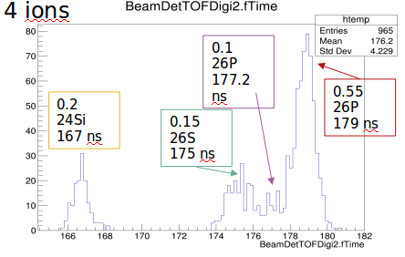

       Рисунок N. Распределение энерговыделений в ToF в случае запуска четырех ионов.

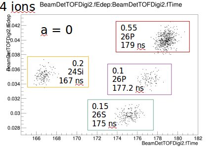

       Рисунок N. Распределение ToF vs. dE для четырех ионов, a=0.

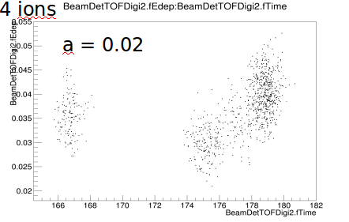

       Рисунок N. Распределение ToF vs. dE для четырех ионов, a=0.002.

Диджитизация MWPC
"""""""""""""""""

Параметры симуляции fEloss, fMWPCNb, fPlaneNb, fWireNb из ветки BeamDetMWPCPoint в классе ERBeamDetDigitizer преобразуются в объекты класса ERBeamDetMWPCDigi, которые располагаются в четырех ветках, соответствующих номерам плоскостей: ERBeamDetMWPCDigiX1, ERBeamDetMWPCDigiX2, ERBeamDetMWPCDigiY1, ERBeamDetMWPCDigiY2.

Погроги диджитизации подбираем так, чтобы в каждом массиве проволочек зажигалась только одна, то есть множественность должна быть равна единице.

Интерфейсы для задания параметров диджитизации MWPC:

  * SetMWPCElossThreshold(Float_t th) – порог по суммарному энерговыделению.
  * SetMWPCElossSigma(Float_t sigma) – размытие по суммарному энегровыделению
  * SetMWPCTimeSigma(Float_t sigma)- рызмытие по времени

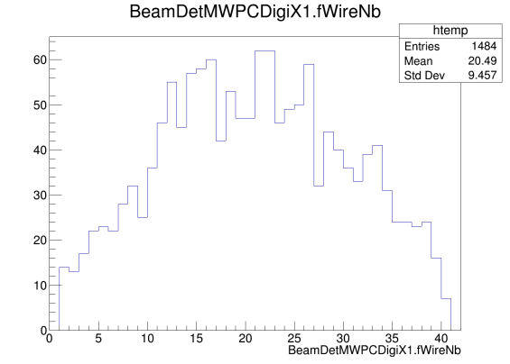

       Рисунок N. Координата пролета иона через MWPC на этапе диджитизации.

Поиск трека (реконструкция)
---------------------------

Параметры диджитизации MWPC в классе ERBeamDetTrackFinder преобразуются в объекты класса ERBeamDetTrack. Для получения координат проволочек из текущей геометрии реализован специальный класс ERBeamDetSetup, который достает параметры геометрии, соответствующие текущему сеансу.

Предполагается, что события с множественностью не равной единице отсеяны на этапе диджитизации. Несмотря на это, проверяем множественность и не записываем события в выходное дерево, если она не равна единице с помощью:

::

  FairRun* run = FairRun::Instance();
  run->MarkFill(kFALSE);

На основе информации о номерах проволочек из каждой плоскости MWPC восстанавливаются координаты точки на мишени и вектор направления импульса. За координату Z для каждой проволочки принимается положение MWPC-станции на оси Z, которой она принадлежит.

Точка попадания иона в мишень воостанавливается через уравнение прямой, проходящей через точки :math:`(X_{MWPC1}, Y_{MWPC1})` и :math:`(X_{MWPC2}, Y_{MWPC2})`.

В результате, имеем ветку, в которой записаны координаты X, Y, Z и направление импульса на мишени:

  * fXt, fYt, fZt
  * fVectorOnTarget

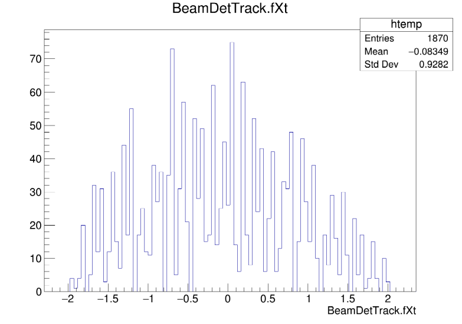

       Рисунок N. Координаты иона на мишени.

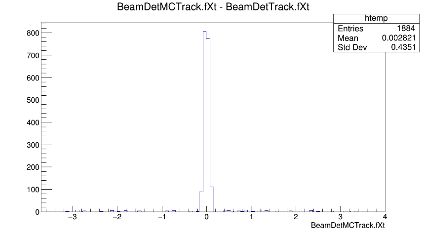

       Рисунок N. Разница между координатами в симуляции и в реконструкции.

Идентификация
-------------

Параметры диджитизации MWPC и реконструкции трека в классе ERBeamDetPID преобразуются в объекты класса ERBeamDetParticle .

Пользователь задает прямоугольную область для идентификации частицы по ToF vs. dE через интерфейс:

::

  void SetBoxPID(tof1, tof2, dE1, dE2);

Массу частицы через:

::

  SetIonMass(mass);

С помощью этих данных считается бета- и гамма- факторы частицы и ее импульс.

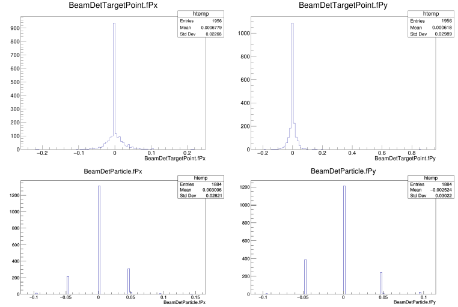

       Рисунок N. Проекции импульса иона на мишени (сверху симуляция, снизу идентификация).

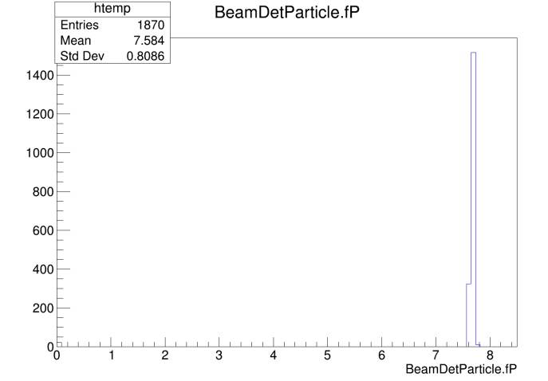

       Рисунок N. Результат отбора по прямоугольной области (Значения для 28S ToF = (177, 180) ns, dE = (0.075, 0.09) GeV).

Генератор ионов
---------------

Мы начинаем с того, что задаёмся угловым и пространственным распределениями ионов на мишени. Пока что это либо равномерное распределение (Box generator), либо Гаусс по каждой координате, но можно использовать более сложные распределения.

Выбранные параметры:
  * SigmaX = SigmaY = 0.5 cm;
  * SigmaTheta = 4 мрад;

Пока что не внедрено квадрупольное магнитное поле, поэтому при реализации ToF использовались пластины большой площади.

Разыгранный на мишени ион переносится параллельно собственному импульсу на 15.3 м назад по оси Z и оттуда бросается на ToF.

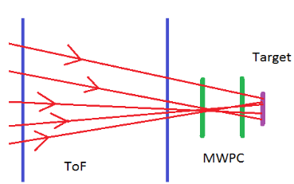

       Рисунок N. Размазывание координат и направления импульса на мишени и перенос в начало детектора.

Все это реализовано классом :ref:`eriongenerator`.

.. TODO проверить где тут должкен быть ERIonGenerator, а где ERIonMixGenerator
