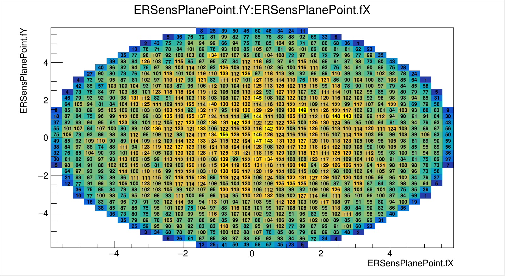
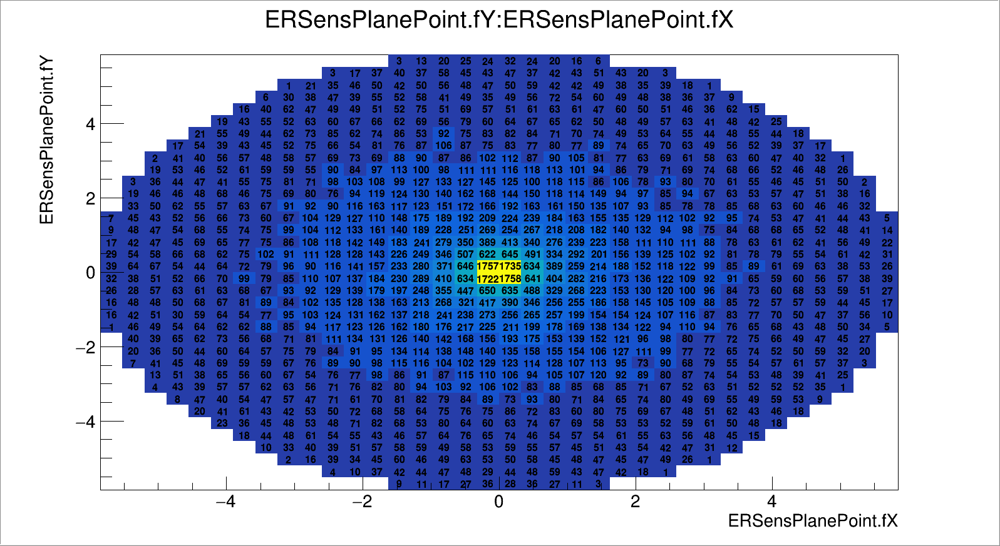

Box generator
=============

Box generator - простой генератор, отправляющий заданную частицу из тонкого (вдоль Z) бокса с заданными размерами вдоль X и Y.

::

  boxGen->SetBoxXYZ(xmin, ymin, xmax, ymax, z);

Присутствует возможность задать направление разными способами. См. код класса FairBoxGenerator пакета FairRoot.

Один из возможных вариантов - задать конус с помощью двух диапазонов углов - theta и phi.

Приведённый ниже код может использоваться для задания генератора в макросе симуляции.
В этом примере плоскость регистрации находилась на расстоянии 10 см от начала координат. Диапазон углов theta генератора был от 0 до 30 градусов, а диапазон углов phi - от 0 до 360 градусов. ``tg(30) = 0.57735026919``, поэтому пятно имеет форму круга с радиусом 5.77 см.

::

  // -----   Create PrimaryGenerator   --------------------------------------
  Int_t pdgId = 22; // gamma 22
  Double32_t kin_energy = .6617; // GeV // Энергия гамма от Cs137 = 661.7 кэВ
  FairPrimaryGenerator* primGen = new FairPrimaryGenerator();
  FairBoxGenerator* boxGen = new FairBoxGenerator(pdgId, 1);

  boxGen->SetEkinRange(kin_energy, kin_energy);
  boxGen->SetThetaRange(0., 30.); // 0-90
  boxGen->SetPhiRange(0., 360.); // 0-360
  boxGen->SetBoxXYZ(0., 0., 0., 0., 0.); // xmin, ymin, xmax, ymax, z
  //boxGen->SetCosTheta();

  primGen->AddGenerator(boxGen);
  run->SetGenerator(primGen);
  // ------------------------------------------------------------------------

.. TODO проверить правильность утверждения ниже

Метод ``SetCosTheta()`` позволяет установить флаг, делающий равномерным распределение не по углу theta, а его косинусу.

       Рисунок 1. Распределение зарегистрированных поинтов в плоскости, перпендикулярной пучку, при включённой опции SetCosTheta().

       Рисунок 1. Распределение зарегистрированных поинтов в плоскости, перпендикулярной пучку, при выключенной опции SetCosTheta().

Тип частицы задаётся с помощью PDG кода. Ниже приведены коды самых используемых частиц.

::

  Electron = 11
  Positron = -11
  Gamma = 22
  Proton = 2212
  ProtonBar = -2212
  Neutron = 2112
  NeutronBar = -2112
  PiPlus = 211
  PiMinus = -211
  MuonMinus = 13
  MuonPlus = -13

::

  Rootino = 0
  Down = 1
  DownBar = -1
  Up = 2
  UpBar = -2
  Strange = 3
  StrangeBar = -3
  Charm = 4
  CharmBar = -4
  Bottom = 5
  BottomBar = -5
  Top = 6
  TopBar = -6
  Gluon = 21
  Pythia92 = 92
  Dd1 = 1103
  Dd1Bar = -1103
  Ud0 = 2101
  Ud0Bar = -2101
  Ud1 = 2103
  Ud1Bar = -2103
  Uu1 = 2203
  Uu1Bar = -2203
  Sd0 = 3101
  Sd0Bar = -3101
  Sd1 = 3103
  Sd1Bar = -3103
  Su0 = 3201
  Su0Bar = -3201
  Su1 = 3203
  Su1Bar = -3203
  Searches0 = 7
  Electron = 11
  Positron = -11
  NuE = 12
  NuEBar = -12
  MuonMinus = 13
  MuonPlus = -13
  NuMu = 14
  NuMuBar = -14
  TauMinus = 15
  TauPlus = -15
  NuTau = 16
  NuTauBar = -16
  Gamma = 22
  Z0 = 23
  WPlus = 24
  WMinus = -24
  Pi0 = 111
  Rho770_0 = 113
  A2_1320_0 = 115
  Rho3_1690_0 = 117
  K0Long = 130
  PiPlus = 211
  PiMinus = -211
  Rho770Plus = 213
  Rho770Minus = -213
  A2_1320Plus = 215
  Proton = 2212
  ProtonBar = -2212
  Neutron = 2112
  NeutronBar = -2112
  K0Short = 310
  K0 = 311
  K0Bar = -311
  KPlus = 321
  KMinus = -321
  Lambda0 = 3122
  Lambda1520 = 3124
  Lambda0Bar = -3122
  SigmaMinus = 3112
  SigmaBarPlus = -3112
  SigmaPlus = 3222
  SigmaBarMinus = -3222
  Sigma0 = 3212
  Sigma0Bar = -3212
  XiMinus = 3312
  XiPlusBar = -3312
  OmegaMinus = 3334
  OmegaPlusBar = -3334
