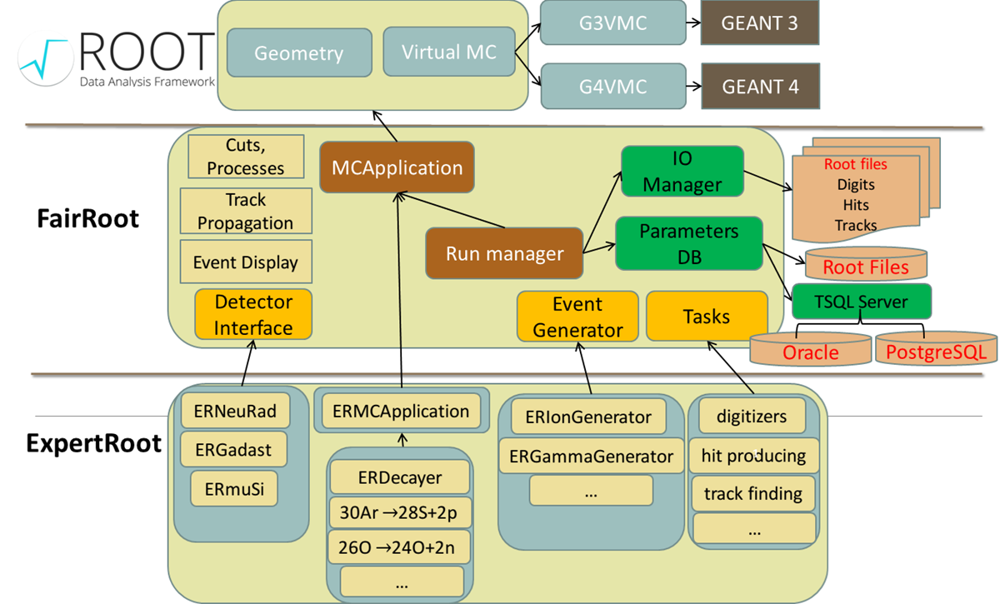
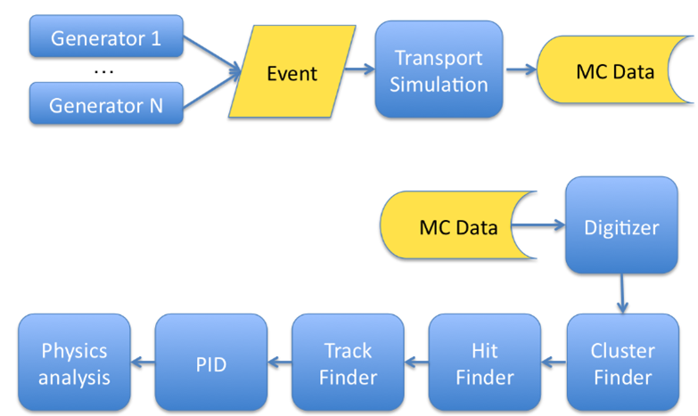

Общее
=====

**EXPERTroot** это фрэймворк для Монте-Карло симуляций откликов детекторов, реконструкции событий и анализа эксперимента EXPERT.
Симуляции необходимы для оптимизации конструкции детекторов, предстказания эффективности и отношения сигнала к фону и разработки и тестирования алгоритмов анализа.

Литература
----------

#. :download:`H. Geissel et al. EXPERT (EXOTIC PARTICLE EMISSION AND RADIOACTIVITY BY TRACKING) STUDIES AT THE SUPER-FRS SPECTROMETER, in VIIth International Symposium on Exotic Nuclei (EXON-2014), Kaliningrad, Russia, 8 - 13 Sept. 2014, pp.579-596. World Scientific, Singapore, 2015.<_bin/EXPERT_EXON2014_short.pdf>`

Структура
---------

EXPERTroot разработан на базе фрэймворка FAIRroot. FAIRroot является набором инструментов и подходов для создания и конфигурирования процедур симуляции, реконструкции и анализа. Большинство классов ER являются наследниками классов FAIRroot.  

В EXPERTroot классы деляться на следующие группы:

#. Классы детекторов (наследованы от FairDetector) - в которых заложена логика сохранения информации об ионизации активных объёмов детекторов. 
#. Классы данных (наследованы от TObject, FairMCPoint, FairHit, ...) - определяют как выглядят структуры данных коллекций объектов, которые пишутся в выходные root файлы.
#. Классы заголовков событий (наследованы от FairHeader и FairMCHeader) - определяет как выглядит структура данных объекта, описывающего событие в целом
#. Классы задач (наследованы от FairTask) - реализуют логику моделирования отклика детектора (диджитизации), реконструкции события - поиска хитов, треков, вершин распада, анализа. 
#. Классы пассивных модулей (наследованы от FairModule) - загружают геометрию пассивных модулей и хранят необходимую информацию.
#. Классы генераторов событий (наследованы от FairGenerator) - загружают в стек треков симуляции первичные треки.
#. Классы обслуживающие логику работы базы данных параметров:

	1. Сеты геометрических параметров GeoPar (наследованы от FairParGenericSet) - реализуют автоматическое чтение и запись информации о геометрии в БД параметров.
	2. Сеты параметров электроники DigiPar (наследованы от FairParGenericSet) - реализуюет чтение и запись параметров электроники в БД параметров.
	3. Фабрики контейнеров параметров (наследованы от FairContFact) - реализуют логику работы с контейнерами параметров. Реализованы как singleton.
	4. Классы установок (setup) - является оболочкой над GeoPar и DigiPar и представляет интерфейс к информации, хранящейся в этих контейнерах. Реализованы как singleton.

#. Классы распадов (наследованы от ERDecay) - реализуют произвольную логику распада - ручное вмешательство в процесс трекинга и состояния стека треков.
#. Служебные классы:
	
	1. ERMCApplication (наследован от FairMCApplication) - перегружен для реализации своей логики распадов.
	2. ERRunSim (наследован от FairRunSim) - перегружен для реализации своей логики распадов.
	3. ERDetector (наследован от FairDetector).
	4. ERStack (наследован от FairGenericStack) - перегружен для возможности отладки. Содержит стек всех треков симуляции.
	5. ERMCTrack (наслдедован от FairMCTrack) - перегружен для возможности отладки.

Event based workflow
--------------------

ER реализует workflow на базе событий.  Монте-Карло событие содержит все продукты одного взаимодействия исследуемого иона с мишенью. Событие также может включать все типы фона, как корелирующего, так и не корелирующего с интересующей реакцией. 

Моделирование транспорта определяет депозиты энергии в активных объёмах каждого детектора. 

Моделирование отклика или диджитизация учитывает гранулярность электроники, неэффективности, шумы, тёмные счёты и продуцирует такую структуру данных сигнала, как если бы он был получен от реального детектора.

Процедуры класстеризации и поиска хитов создают гипотезу о том, где пролетела частица.

Процедура поиск трека определяет какие хиты принадлежат одному треку. 

Процедура идентификации частицы восстанавливает характеристики частицы по характеристикам треков и хитов.

Физический анализ служит для тестирования на правдоподобность и получение конечной физической информации.

Отметим, что все шаги после диджитизации являются одинаковыми как для симуляций, так и для реальных данных из эксперимента.

Пользовательские распады
------------------------

Классы Setup
------------