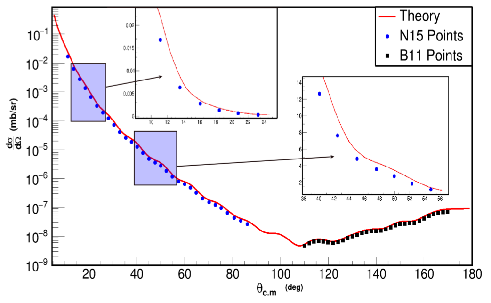

Interactions
============

Пакет ExpertRoot обладает собственным подходом добавления взаимодействий в процесс транспорта частиц. Этот подход основан на возможности пользователя написать свою собственную обработку Stepping Action библиотеки транспорта и возможности добавлять в стэк треков новые треки.

У такого подхода есть два достоинства:

1. Исследователь может заложить только ту информацию о взаимодействии, которой обладает.
2. Взаимодействие встроено в процесс транспорта, поэтому нет необходимости заранее наигрывать параметры первичного иона в момент взаимодействия.

Elastic scattering
------------------

.. Автозамены
.. |empty| unicode:: U+2063
.. |theta| unicode:: U+03F4
.. |alpha| unicode:: U+03B1
.. |phi|  unicode:: U+03C6

Постановка задачи упругого рассеяния
~~~~~~~~~~~~~~~~~~~~~~~~~~~~~~~~~~~~

Ион **А** с энергией \ :sup:`A` \ **E**\ :sub:`0` , импульсом \ :sup:`A` \ **P**\ :sub:`0` \(**P**\ :sub:`x` , **P**\ :sub:`y` , **P**\ :sub:`z` ),
начальными пространственными координатами \ :sup:`A` \ **r**\ :sub:`0` \(**x**\ :sub:`0` , **y**\ :sub:`0` , **z**\ :sub:`0` ) налетает на покоящуюся мишень
состоящую из атомов **B**.
Ион **A** многократно рассеивается внутри объёма мишени, на некотором шаге выбивает ион **B**, и далее уже оба иона многократно рассеиваются пока не покинут объем мишени.
В результате - новые характеристики \ :sup:`A` \ **E**\, \ :sup:`A` \ **P(P**\ :sub:`x` , **P**\ :sub:`y` , **P**\ :sub:`z` ), \ :sup:`A` \ **r(x**, **y**, **z**)- для иона **А**,
и следующие для иона **B**: \ :sup:`B` \ **E**\, \ :sup:`B` \ **P(P**\ :sub:`x` , **P**\ :sub:`y` , **P**\ :sub:`z` ), \ :sup:`B` \ **r(x**, **y**, **z**).

    .. figure:: _images/elastic_fig1.png
        :height: 600px
        :width: 600 px
        :align: center

Рассмотрим добавления упругого рассеяния в сессию симуляции на примере рассеяния иона 15N на мишени 11B. Создаем класс коллекции взаимодействий и класс взаимодействия::

    ERDecayer* decayer = new ERDecayer();
    ERElasticScattering* scattering = new ERElasticScattering("15Nto15N11B");

15Nto15N11B - Имя взаимодействия.

Входные данные
~~~~~~~~~~~~~~

Пользователь должен знать:

#. Следующие характеристики ионов:

    * A - атомная масса
    * Z - число протонов
    * Q - заряд

   Для налетающего иона, например для \ :sup:`15` \N, данные характеристике задаются так::

    scattering->SetInputIon(7,15,3); // Z = 7, A = 15, Q = 3

   А для иона мишени, например \ :sup:`11` \B так::

    scattering->SetTargetIon(5,11,5); // Z = 5, A = 11, Q = 5

#. Способ определения кинематических характеристик.

   По умолчанию, используется изотропное распределение угла рассеяния |theta|.

   Возможно задание кумулятивной функции распределения:

   Задаём имя текстового файла с данными о кумулятивной функции::

    scattering->SetThetaCDF("cos_tetta_cross.txt");

   Структура текстового файла должна быть следующая::

    4.5 0.0448573496944
    4.6 0.087071447189
    4.7 0.126858356665
    4.8 0.164410246312
    4.9 0.199891413123
    5.0 0.233459173925
    5.1 0.26523651571
    5.2 0.295359837723

    ... ...

    179.3 0.99999999789
    179.4 0.999999998493
    179.5 0.999999998995
    179.6 0.999999999397
    179.7 0.999999999698
    179.8 0.999999999899
    179.9 1.
    180.0 1.

   Где первый столбец соответствует углам |theta| в системе центра масс, а второй — значениям кумулятивной функции для данных значений углов |theta|.
   Текстовый файл с данными о кумулятивной функции должен лежать в директории **er/input** .
   
   .. tip:: Формировнае кумулятивной функции на основе теоретической кривой осущесвляется в любой программе
            для работы с электронными таблицами. 
            
             .. figure:: _images/elastic_fig2.png
                 :height: 600px
                 :width:  600 px
                 :align: center 
                 
                 
   
#. Способ определения координаты взаимодействия.

    * Для изотропного розыгрыша координаты взаимодействия внутри объёма мишени. Задать переднюю координату мишени и заднюю относительно глобальной оси **z**: ::

        scattering->SetUniformPos(-0.00035,0.00035);

    .. tip:: Использовать в случае **тонкой** мишени.

    .. figure:: _images/elastic_fig3.png
        :height: 600px
        :width: 600 px
        :align: center

        Обычно мишень располагается в начале глобальной системы координат, данный рисунок иллюстрирует этот случай.

    * Для экспоненциального розыгрыша координаты взаимодействия, используйте метод::

        SetExponentialPos(Double_t start, Double_t tau);

    .. tip:: Использовать в случае **толстой** мишени.

#. Точность необходимую для определения положение координаты взаимодействия.

    Для этого задаем шаг пророгации внутри объёма мишени::

        scattering->SetStep(0.00001); //0.1 micron

#. Способ выбора диапазона розыгрыша углов |theta|\ :sub:`CM`  и |phi|\ :sub:`CM` для выбираемой частицы. 

    По умолчанию |theta|\ :sub:`CM`  разыгрывается внутри диапазона от 0\ :sup:`0`  до 180\ :sup:`0` ,а  |phi|\ :sub:`CM`  от 0\ :sup:`0`  до 360\ :sup:`0` .
    Если же стоит задача измерения эффективности (отношения сигнала к фону) отдельно стоящего детектора, а не целого экспериментального сетапа,
    стоит ограничить диапазон углов (соответствующий телесному углу, под которым виден детектор), чтобы не симулировать большое число событий,
    в которых продукты реакции в детектор не попадают. 

    * Выбрать диапазон розыгрыша |theta|\ :sub:`CM`  можно:

        #. Явно::

            scattering->SetThetaRange(18.4, 19.4, kPROJECTILE);

        #. Косвенно. Через следующие величины:

            * Координату |theta|\ :sub:`Lab` \  центра диапазона розыгрыша.

            * *Полуширину* выбираемого диапазона 0.5*d |theta| в лабораторной системе координат::

                scattering->SetLabThetaRange(thetaCenter, dTheta, kPROJECTILE);

            .. attention:: Важно выбирать полуширину с запасом!
        
        В обоих случаях третьим параметром нужно передать симулируемую частицу, которая будет лететь в детектор.
        Этой частицей может быть:
        
        * **kPROJECTILE** - налетающая частица.
        * **kTARGET** - частица мишени.
        
        Далее по формулам, которые приведены ниже рассчитываются: |theta|\ :sub:`CM1`  и |theta|\ :sub:`CM2` ,
        где |theta|\ :sub:`CM1`  и |theta|\ :sub:`CM2`  крайние значения расчитываемого диапозона.

        Когда M\ :sub:`1` \< M\ :sub:`2` \

        .. math::

            0 \leqslant \theta_1 \leqslant \pi\ ,\\

        а когда  M\ :sub:`1` \ > M\ :sub:`2` \

        .. math::

            0 \leqslant \theta_1 \leqslant \theta_{1max} \leqslant \frac{\pi}{2}\ ,\\

        в обоих случаях:

        .. math::

            \theta_{cm1} = \arccos\left [  -\frac{M_1}{M_2} + sin^2(\theta_1-d\theta) + cos(\theta_1-d\theta)\sqrt{1 - \frac{M_1^2}{M_2^2}sin^2(\theta_1-d\theta)} \right ]\ ,

            \theta_{cm2} = \arccos\left [  -\frac{M_1}{M_2} + sin^2(\theta_1+d\theta) + cos(\theta_1+d\theta)\sqrt{1 - \frac{M_1^2}{M_2^2}sin^2(\theta_1+d\theta)} \right ]\ .

        Когда M\ :sub:`1` \ = M\ :sub:`2` \

        .. math::

            0 \leqslant \theta_1 \leqslant \frac{\pi}{2}\ ,\\

        .. math::

            \theta_{cm1} = 2(\theta_1-d\theta) ,

            \theta_{cm2} = 2(\theta_1+d\theta) .

        Для первоначально покоившихся частиц (во всех случаях):

        .. math::

            \theta_{cm1} = \pi - 2(\theta_2-d\theta) ,

            \theta_{cm2} = \pi - 2(\theta_2+d\theta) .

        M\ :sub:`1`  - масса налетающей частицы,

        M\ :sub:`2`  - масса покоящейся частицы,

        |theta|\ :sub:`1`  - угол рассеяния налетающей частицы (Лаб. Сит.),

        |theta|\ :sub:`2`  - угол вылета покоящейся частицы (Лаб. Сит.).

        d |theta| - полуширина выбираемого диапазона (Лаб. Сит.).

    .. tip::
        Задавать диапазон розыгрыша косвенно: через координату |theta|\ :sub:`Lab` \  центра диапазона розыгрыша и
        полуширину выбираемого диапазона d |theta| - предпочтительнее! Эти параметры всегда известны 
        пользователю, потому что все элементы геометрии позиционируется в Лаб. Сит.!
        
    * Диапазон розыгрыша для |phi| выбирается явно::

        scattering->SetPhiRange(-20., 20.);

Механизм работы класса
~~~~~~~~~~~~~~~~~~~~~~

Добавляем упругое рассеяние в коллекцию распадов::

    decayer->AddDecay(scattering);

Ниже опишем что будет происходить после этого.

Класс ElasticScattering содержит два основных метода: Intit(), Stepping().

Bool_t ElasticScattering::Init()
""""""""""""""""""""""""""""""""

Данный метод вызывается в самом начале симуляции, на этапе инициализации.

* Здесь проверяется::

    if (!ERDecay::Init())
    {
        return kFALSE;
    }

    fTargetIonPDG = TDatabasePDG::Instance()->GetParticle(fTargetIonName);
    if ( ! fTargetIonPDG )
    {
        LOG(FATAL)<< "Target ion not found in pdg database!" << FairLogger::endl;
        return kFALSE;
    }

* Считается диапазон розыгрыша углов |theta|\ :sub:`CM` \  - вызовом private процедуры::

    ERElasticScattering::ThetaRangesLab2CM(Doubleр_t pM, Double_t tM)

  где pM - масса налетающей частицы, а tM - частицы мишени.

  .. note:: В случае явного определения диапазона розыгрыша |theta|\ :sub:`CM` \ , метод описанный выше не вызывается!

* Так же здесь формируется кумулятивная функция - вызовом private метода::
   
    ERElasticScattering::ThetaCDFRead();

Bool_t ElasticScattering::Steping()
"""""""""""""""""""""""""""""""""""

Вызывается на каждом шаге транспорта налетающего иона внутри объёма мишени.

Здесь разыгрываются углы вылета для ионов - налетающего и мишени, следующим образом::

    // Generate random angles theta and phi
    Double_t theta = ThetaGen();
    Double_t phi = fRnd->Uniform(fPhi1*DegToRad(), fPhi2*DegToRad());
    
Метод::

     ERElasticScattering::ThetaGen();

генерирует угол |theta|\ :sub:`CM` из кумулятивной функции.

Затем ионы с новыми характеристиками кидаются в стек частиц для дальнейшего транспорта.

Связь лабораторной и центра масс систем
~~~~~~~~~~~~~~~~~~~~~~~~~~~~~~~~~~~~~~~

.. figure:: _images/elastic_fig4.png
    :height: 600px
    :width:  600 px
    :align: center

На рисунке выше ион А упруго рассеивается на ионе B. В имплементации метода ElasticScattering::Steping() углы |theta|\ :sub:`CM` \
разыгрываются в системе координат (на рис., выше выделена красным) у которой ось z  направлена вдоль импульса первичного иона.
Необходимо  повернуть систему координат (2) так что бы ее ось z  совпала с-осью z  из (3).
С помощью методов TLorentzVector::

    TLorentzVector::RotateZ(-phi);
    TLorentzVector::RotateY(theta);
    TLorentzVector::RotateZ(phi);

В стек частиц упруго рассеявшаяся ионы необходимо передать с характеристиками в лабораторной системе координат: Px, Py, Pz и E - энергия.
Для перехода из системы центра масс в лабораторную используется Boost::

    TLorentzVector::Boost(TVector3 &);

Подробнее об этом можно прочесть здесь: https://root.cern/doc/v616/classTLorentzVector.html

Полезные методы
~~~~~~~~~~~~~~~

* Метод возвращающий число взаимодействии в мишени по всем событиям в run-е::
    
    scattering->GetInteractNumInTarget();
    
* Метод возвращающий среднее арифметическое |theta|\ :sub:`CM`  по всем событиям в run-е::
  
    scattering->GetThetaCMMean();
    
* Метод возвращающий массу налетающего иона::
    
    scattering->GetProjectileIonMass();
    
* Метод возвращающий массу иона мишени::

    scattering->GetTargetIonMass();

* Метод возвращающий величину диапазона кумулятивной функции (CDFMax-CDFMin)::
  
    scattering->GetdThetaCDF();
    
    
Пример использования класса
~~~~~~~~~~~~~~~~~~~~~~~~~~~

Класс **ERElasticScattering** использовался для моделирования упругого рассеяния\ :sup:`15` \ N на \ :sup:`11` \ B.

Ниже представлен управляющий макрос для симуляции::

    void sim(Int_t nEvents = 100, Int_t index = 0, TString outDir="output", Double_t angle = 20.)
    {
        gRandom->SetSeed(index);

        //---------------------Files-----------------------------------------------
        TString outFile;
        outFile.Form("%s/sim_%d.root", outDir.Data(), index);
        TString parFile;
        parFile.Form("%s/par_%d.root", outDir.Data(), index);
        // ------------------------------------------------------------------------

        // -----  Timer  --------------------------------------------------------
        TStopwatch timer;
        timer.Start();

        // -----  Create simulation run  ----------------------------------------
        ERRunSim* run = new ERRunSim();
        /** Select transport engine
        * TGeant3
        * TGeant4
        **/
        run->SetName("TGeant4");              // Transport engine
        run->SetOutputFile(outFile.Data());          // Output file

        // ------------------------------------------------------------------------
        // -----  Runtime database  ---------------------------------------------
        FairRuntimeDb* rtdb = run->GetRuntimeDb();
        // ------------------------------------------------------------------------

        // -----  Create media  -------------------------------------------------
        run->SetMaterials("N15.media.geo");      // Materials
        // ------------------------------------------------------------------------

        //-------- Set MC event header --------------------------------------------
        ERDecayMCEventHeader* header = new ERDecayMCEventHeader();
        run->SetMCEventHeader(header);
        //-------------------------------------------------------------------------

        // -----  Create detectors  ----------------------------------------------
        FairModule* cave= new ERCave("CAVE");
        cave->SetGeometryFileName("cave.geo");
        run->AddModule(cave);

        FairModule* collimator = new ERCollimator(); // "N15B11_collimator", "N15B11_collimator"
        collimator->SetGeometryFileName("N15.collimator.root");
        run->AddModule(collimator);

        ERDetector* target = new ERTarget("N15B11_target", kTRUE, 1);
        target->SetGeometryFileName("N15.target.root");
        run->AddModule(target);

        FairDetector* detector = new ERN15B11Detector("N15B11detector", kTRUE, 1);
        detector->SetGeometryFileName("N15B11_detector.geo.root");
        run->AddModule(detector);

        //------    ER Decayer  -------------------------------------------------
        //Ion 15N
        Int_t A = 15;
        Int_t Z = 7;
        Int_t Q = 3;

        ERDecayer* decayer = new ERDecayer();
        ERElasticScattering* scattering = new ERElasticScattering("15Nto15N11B");

        scattering->SetInputIon(Z,A,Q);
        scattering->SetTargetIon(5, 11, 5); // 11B
        scattering->SetThetaCDF("cos_tetta_cross.txt");
        scattering->SetUniformPos(-0.00035,0.00035);
        scattering->SetStep(0.00001); //0.1 micron
        scattering->SetDecayVolume("cave"); //targetB11
        scattering->SetDetectorsSlot(angle, 4.*0.262822833);
        scattering->SetPhiRange(-20., 20.);

        decayer->AddDecay(scattering);
        run->SetDecayer(decayer);

        // -----  Create PrimaryGenerator  --------------------------------------
        FairPrimaryGenerator* primGen = new FairPrimaryGenerator();
        ERIonMixGenerator* generator = new ERIonMixGenerator("15N", Z, A, Q, 1);
        generator->SetKinERange(0.0427094, 0.0436017); // 0.0427094 : 0.0436017

        Double32_t theta = 0.;
        Double32_t sigmaTheta = 5e-3*TMath::RadToDeg();
        generator->SetThetaSigma(theta, sigmaTheta); // theta = 0., sigma = 5 mrad
        generator->SetPhiRange(0., 180.); // 0 : 180

        Double32_t distanceToTarget = 50.; // work: 50 cm, test 0.5 micron: 0.00005+0.00035
        generator->SetBoxXYZ(-0.5, -0.5, 0.5, 0.5, -distanceToTarget); // Xmin = -0.5, Ymin = -0.5, Xmax = 0.5, , Ymax = 0.5, Z

        primGen->AddGenerator(generator);

        run->SetGenerator(primGen);
        // ------------------------------------------------------------------------

        //-------Set visualisation flag to true------------------------------------
        run->SetStoreTraj(kFALSE); // or kTRUE

        //-------Set LOG verbosity  -----------------------------------------------
        FairLogger::GetLogger()->SetLogVerbosityLevel("LOW");
        FairLogger::GetLogger()->SetLogScreenLevel("DEBUG");

        //------- Initialize simulation run ---------------------------------------
        run->Init();
        Int_t nSteps = -15000;

        //--- Runtime database ----------------------------------------------------
        Bool_t kParameterMerged = kTRUE;    /** @brief Returns curent theta in CM for Primary Ion. **/
        FairParRootFileIo* parOut = new FairParRootFileIo(kParameterMerged);
        parOut->open(parFile.Data());
        rtdb->setOutput(parOut);
        rtdb->saveOutput();
        rtdb->print();

        // -----  Run simulation  ------------------------------------------------
        run->Run(nEvents);

        // -----  Finish  -------------------------------------------------------
        timer.Stop();
        Double_t rtime = timer.RealTime();
        Double_t ctime = timer.CpuTime();
        cout<< endl << endl;
        cout<< "Macro finished succesfully." << endl;
        cout<< "Output file is sim.root" << endl;
        cout<< "Parameter file is par.root" << endl;
        cout<< "Real time " << rtime << " s, CPU time " << ctime
        << "s" << endl << endl;
    }

Результаты моделирования
~~~~~~~~~~~~~~~~~~~~~~~~

.. figure:: _images/elastic_fig5.png
    :height: 600px
    :width:  600 px
    :align: center

    На данном рисунке мы отоброзили как некоторые физические факторы влияют на угловое разрешение.

    #. Мы начали с идеальной реакции с идеальным пучком, без мишени, без коллиматора, но с реалистичной щелью детектора и последовательно добавили следующие реалистичные свойства:

    #. 11B мишень толщиной 7 микрон
    #. Энергетическое размытие пучка иона 15N (42 : 43 МэВ)
    #. Размытие угла  пучка иона 15N (sigma = 5 мрад)
    #. Размытие угла  пучка иона 15N (0 : 2)
    #. X размытие пятна пучка на мишени (-0.5 : 0.5 см)
    #. Y размытие пятна пучка на мишени (-0.5 : 0.5 см)
    #. Коллиматор пучка (размер отверстия 1.5 см)

    Измеренное дифференциальное сечение как функция угла рассеяния  в ЦМ

    На данном рисунке представлено сравнение входного дифференциального сечения и выходного  (полученного по результатам симуляции).
    Здесь можно видеть два главных эффекта:

    #. Полученная зависимость становиться менее крутой в передних углах.
    #. Волновое поведение исходной кривой становится менее выраженным.

В результате работы было продемонстрировано, что восстановленное дифференциальное сечение немного отличается от входного
Основной причиной этого различия является размер пятна пучка на мишени
Влияние длины щели оказалось незначительно, следовательно, она может быть увеличено для лучшей эффективности обнаружения
Разработанное программное обеспечение будет использоваться для планирования и анализа подобных экспериментов в будущем.

Interaction class
-----------------

Реализация своего взаимодействия добавляется с помощью создания класса, унаследованного от `ERDecay`. Коды распадов расположены в дирeктории `decays`.

В новом классе необходимо написать реализации методов: `Init`, `BeginEvent`, `FinishEvent`, `Stepping`.

В методе `Init` необходимо проверить все ли ионы и частицы, которые учавствуют в распаде добавлены в объект распада и в Root библиотеку частиц - `TDatabasePDG`.

::

  if (fInputIon) {
    fInputIonPDG = TDatabasePDG::Instance()->GetParticle(fInputIonName);
    if ( ! fInputIonPDG ) {
        std::cerr  << "ERTextDecay: Ion " << fInputIonName << " not found in database!"<< endl;
        return kFALSE;
    }
  }
  else{
    std::cerr  << "Input ion not defined"<< endl;
    return kFALSE;
  }

Также необходимо проверить все ли входные текстовые файлы и другие настройки распада указаны.

::

  if (fFileName == "") {
    cerr << "File for " << fName << " decay not defined!" << endl;
    return kFALSE;
  }

Метод `BeginEvent` вызывается в начале каждого события. Стандартно в этом методе необходимо реинициализировать часть переменных распада и разыграть вероятностные характеристики распада, в частности, позицию распада.

::

  fDecayFinish = kFALSE;
  if (fUniform){
    fDecayPosZ = fRnd->Uniform(fUniformA, fUniformB);
  }
  if (fExponential){
    fDecayPosZ = fExponentialStart + fRnd->Exp(fExponentialTau);
  }

Метод `Stepping` вызывается на каждом шаге транспорта всех частиц. В нём закладывается условие распада и добавляются новые треки в стек треков. Типичная структура этого метода представлена далее.

Проверка того, что мы рассматриваем трекинг интересующего нас иона и установка малого шага трека для того чтобы максимально точно выбрать позицию распада:

::

  if(!fDecayFinish && gMC->TrackPid() == fInputIonPDG->PdgCode()){
    gMC->SetMaxStep(0.01);
    gMC->TrackPosition(fDecayPos);

Провека что распад выполниться именно на этом шаге:

::

    if (fDecayPos.Z() > fDecayPosZ){
      gMC->TrackMomentum(fInputIonV);
      //Add new ion
      Int_t newTrackNb;
      vector<TLorentzVector> decay = fDecays[gMC->CurrentEvent()];

Добавление новых частиц в стек для трнспорта:

::

      gMC->GetStack()->PushTrack(1,gMC->GetStack()->GetCurrentTrackNumber(), fOutputIonPDG->PdgCode(),
                           outputIonV.Px(),outputIonV.Py(),outputIonV.Pz(),
                           outputIonV.E(), fDecayPos.X(), fDecayPos.Y(), fDecayPos.Z(),
                           gMC->TrackTime(), 0., 0., 0.,
                           kPDecay, newTrackNb, fOutputIonPDG->Mass(), 0);

Окончание распада. Остановка первичного иона. Возвращение максимального шага транспорта. Сохранение
характеристик распада в объект `MCEventHeader` .

::

      fDecayFinish = kTRUE;
      gMC->StopTrack();
      gMC->SetMaxStep(10000.);
      SaveToEventHeader();
    }
  }
  return kTRUE;

Decay definition in macro
-------------------------

Инициализация менеджера запуска.

::

  void decay(Int_t nEvents = 10) {
    //---------------------Files-----------------------------------------------
    TString outFile= "sim.root";
    TString parFile= "par.root";
    // ------------------------------------------------------------------------

    // -----   Timer   --------------------------------------------------------
    TStopwatch timer;
    timer.Start();
    // ------------------------------------------------------------------------

    // -----   Create simulation run   ----------------------------------------
    ERRunSim* run = new ERRunSim();
    run->SetName("TGeant4");
    run->SetOutputFile(outFile.Data());
    // ------------------------------------------------------------------------

    // -----   Runtime database   ---------------------------------------------
    FairRuntimeDb* rtdb = run->GetRuntimeDb();
    // ------------------------------------------------------------------------

    // -----   Create media   -------------------------------------------------
    run->SetMaterials("media.geo");       // Materials
    // ------------------------------------------------------------------------

Если необходимо сохранять параметры распада в выходной файл необходимо добавить `MCEventHeader`.

::

  //-------- Set MC event header --------------------------------------------
  ERDecayMCEventHeader* header = new ERDecayMCEventHeader();
  run->SetMCEventHeader(header);
  //-------------------------------------------------------------------------

Добавить необходимую геометрию в событие:

::

  // -----   Create detectors  ----------------------------------------------	
  FairModule* cave= new ERCave("CAVE");
  cave->SetGeometryFileName("cave.geo");
  run->AddModule(cave);

  FairModule* target = new ERTarget("Target", kTRUE, 1);
  target->SetGeometryFileName("Li10_target.geo.root");
  run->AddModule(target);

  // ------------------------------------------------------------------------

Добавить ERDecayer и добавить в него сконфигурированные распады:

::

  //------    ER Deacayer   -------------------------------------------------
  ERDecayer* decayer = new ERDecayer();
  ERDecay* targetDecay = new ERDecayLi9DetoLi10_Li9n_p();
  decayer->AddDecay(targetDecay);
  //-------------------------------------------------------------------------

Добавить генератор первичного иона.

::

      // -----   Create PrimaryGenerator   --------------------------------------
      FairPrimaryGenerator* primGen = new FairPrimaryGenerator();

      ERIonGenerator* ionGenerator = new ERIonGenerator("Li9",3,9,3,1);
      Double32_t kin_energy = 0.025*9; //GeV
      Double_t mass = ionGenerator->Ion()->GetMass();
      Double32_t momentum = TMath::Sqrt(kin_energy*kin_energy + 2.*kin_energy*mass); //GeV
      ionGenerator->SetPRange(momentum, momentum);
      Double32_t theta1 = 0.;  // polar angle distribution
      Double32_t theta2 = 0.0001*TMath::RadToDeg();
      ionGenerator->SetThetaRange(theta1, theta2);
      ionGenerator->SetPhiRange(0, 360);
      ionGenerator->SetBoxXYZ(-0.4,-0.4,0.4,0.4,-10);
      primGen->AddGenerator(ionGenerator);

      run->SetGenerator(primGen);
      // ------------------------------------------------------------------------

Закончить инициализацию и запустить расчёт:

::

    //-------------------------------------------------------------------------
    // -----   Runtime database   ---------------------------------------------
    Bool_t kParameterMerged = kTRUE;
    FairParRootFileIo* parOut = new FairParRootFileIo(kParameterMerged);
    parOut->open(parFile.Data());
    rtdb->setOutput(parOut);
    rtdb->saveOutput();
    rtdb->print();
    //-------------------------------------------------------------------------

    // -----   Run simulation  ------------------------------------------------
    run->Run(nEvents);
    //-------------------------------------------------------------------------

    // -----   Finish   -------------------------------------------------------
    timer.Stop();
    Double_t rtime = timer.RealTime();
    Double_t ctime = timer.CpuTime();
    cout << endl << endl;
    cout << "Macro finished succesfully." << endl;
    cout << "Output file is sim.root" << endl;
    cout << "Parameter file is par.root" << endl;
    cout << "Real time " << rtime << " s, CPU time " << ctime
        << "s" << endl << endl;
    //-------------------------------------------------------------------------
  }

ERTextDecay - decay from text file
----------------------------------

`ERTextDecay` - класс распада, в котором чтение результатов распада происходит из текстового файла следующей структуры:

::

   10000    8.00    1.00    1.00    0.0000   10.0000    0.1653    0.3100   90.0000  -45.0000    1.0000    0.8000    1.0000
 0.7206406E+01 -0.1754454E+02  0.5639178E+02 -0.1327796E+03  0.7652269E+00 -0.3139226E+02  0.7600432E+02  0.1677931E+02 -0.2499952E+02  0.5677531E+02  0.2169820E+00
 0.9067860E+01 -0.2866158E+02 -0.3239947E+02 -0.9974271E+02 -0.1909192E+02 -0.4091810E+01  0.1072426E+03  0.4775351E+02  0.3649128E+02 -0.7499936E+01  0.1777150E+00
 0.7098366E+01 -0.4391382E+02 -0.1458367E+02  0.1816315E+02  0.9634398E+02  0.1606081E+02 -0.2588241E+02 -0.5243016E+02 -0.1477139E+01  0.7719253E+01  0.2744438E+00

Первая строчка является шапкой файла и параметрами генерации. Данная информация не используется при реализации распада в ExpertRoot. Далее каждая строка в файле задает событие. Первое число - энергия возбуждения, также не используется в добавлении распада в транспорт. Далее записаны вектора импульсов выходов распада. Последняя колонка - угол реакции - тоже не используется.

Все импульсы указываются в системе центра масс распада. При чтении из файла импульсы переводятся в лабораторную СК с учётом импульса первичного иона в момент распада.

Все файлы распадов должны находится в папке `input`.

Для добавления данного распада в событие необходимо добавить в макрос:

::

  //------    ER Deacayer   -------------------------
  ERDecayer* decayer = new ERDecayer();
  ERTextDecay* decay = new ERTextDecay("10Heto8He2n");
  decay->SetInputIon(2,10,2);
  decay->SetOutputIon(2,8,2);
  decay->AddOutputParticle(2212);
  decay->AddOutputParticle(2212);
  decay->SetDecayPosZ(2.);
  decay->SetFileName("generator_10He_decay.dat");
  decayer->AddDecay(decay);
  run->SetDecayer(decayer);

При инициализации необходимо указать входной ион, выходной ион и набор выходных частиц через массовые числа или pdg. Далее необходимо указать позицию распада по Z и файл распада с импульсами выходных частиц.

Позицию распада также можно задать с помощью равномерного распределения. Это уместно для тонкой мишени.

::

  SetUniformPos(Double_t a, Double_t b);

И с помошью экспоненциального распределения. Это уместно для толстой мишени.

::

  SetExponentialPos(Double_t start, Double_t tau);
