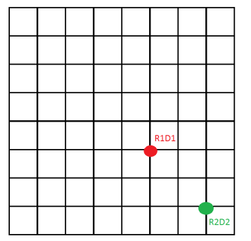

Detector development
======

NeuRad
-------------------------

Description of the prototype. Материал сцинтиллятора задан как стехиометрический эквивалент полистирола. Наличие МА ФЭУ на торцах прибора моделируется прямоугольными  пластинами из алюминия толщиной 2.4 мм.

::

  BC408               2  1.00794  12.0107  1.  6.  1.032  0.0764  0.916
                      1  1  20.  .001
                      0
  aluminium           1  26.98 13. 2.7
                      0  1  20.  .001
                      0
  vacuum              1  1.e-16  1.e-16  1.e-16
                      0  1  20.  .001
                      0

Wuppertal tests
~~~~~~~~~~~~~~~

Energy resolution measurements. Where can be experimental data found?

Все измерения можно сгруппировать следующим образом.

	#. Измерения без ФЭУ
	#. Измерения с ФЭУ и лазером, но без сцинтиллятора
	#. Измерения со сцинтиллятором, но без источников (фоновые)
	#. Измерения с радиоактивными источниками (Am-241, Cs-137, Y(Sr)-90)

Измерения без ФЭУ
""""""""""""""""""

Это калибровочные измерения. Импульс напряжения с точного генератора посылался через резистор и плату аттеньюатор (емкостной делитель) на вход поочередно каждого из 64 использованных каналов NXyter (всего каналов 128). Электрическая схема измерений показана на рис. **X**. Если мы ничего не упустили (типа забытого шунтирующего резистора), заряд, инжектированный в канал, определяется напряжением и длительностью импульса (100ns) и составляет  

Измерения с аттеньюатором  “680pF” проводились при длительности импульса   нс и значениях напряжения (В): 0.5; 1.0; 1.5; 1.75; 2.0; 2.25; 2.5; 2.75; 3.0; 3.25.  Эти измерения позволяют получить безразмерную функцию компенсации нелинейности. Эта функция переводит считанное значение АЦП, скорректированное на «базовую линию», в значение АЦП же, но с подавленной нелинейностью.   Для всех каналов значениям, попадающим в зону насыщения, сопоставляется 0, что позволяет исключить  при анализе события, в которых есть насыщенные каналы.  Также можно не учитывать при суммировании каналы, значения АЦП в которых слишком малы и попадают в зону электрических наводок от соседних каналов. 

Поскольку функция компенсации нелинейности применима при любом аттеньюаторе, для переноса калибровки на измерения с аттеньюатором “4.7 nF”  достаточно одного значения напряжения генератора.  Логика переноса для каждого канала такова.  

	#. В каждом канале находится положение одноэлектронного пика (см следующий раздел)
	#. В каждом канале определяется, скольким одноэлектронам соответствует пик 0.5В. 
	#. Это число умножается на 6 и ставится в соответствие положению пика от импульсов генератора с напряжением 3В и той же длительность с аттеньюаторе “4.7 nF”

**Файлы калибровочных измерений:**
::

	680pF_10okt_chargeCalib/pedestals_10okt_withGenerator_woPMT_scan_000*.lmd
	680pF_11okt_chargeCalib/pedestals_11okt_withGenerator_woPMT_scan_000*.lmd
	680pF_14okt_measure_chargeCalib/pedestals_14oct_Generator_thr35_woPMT_680pF*_000*.lmd
	4.7nF_11okt_chargeCalib/ TestTriggerMode_chargeCalib_3V_100ns_4.7nF_11oct_000*.lmd

Измерения с ФЭУ и лазером, но без сцинтиллятора
"""""""""""""""""""""""""""""""""""""""""""""""

Измерения были с маской и без. С маской больше частота вспышек (1кГц) Маска – это крышка с квадратными отверстиями 4х4 мм в двух пикселях. 

**Файлы:**
::

	680pF_10okt/LED_30cm_5V_1kHz_**_mask_HV1000_thr29_nxtrim1_10oct_10minutes_0000.lmd
	680pF_10okt/LED_60cm_4.5V_1kHz_30ns_mask_HV1000_thr29_nxtrim1_10oct_10minutes_0000.lmd

Файлы отличаются количеством света во вспышке. Сравнение может быть полезно при исследовании кросс-толков и для исследования 2-3-4 электронных импульсов на основе распределения Пуассона с разным средним. 

Измерения без маски позволяют получить распределения амплитуд с некоторым средним числом фотоэлектронов по всем пикселям. Также можно оценить относительную эффективность (quantum eff x collection eff) QE(xCE) пикселей (предполагая засветку равномерной и анализируя полное число одноэлектронов). Распределение относительной QE(xCE)  по пикселям можно сравнить с результатом скана из **файла**
::
	HA1365_HV00_Histo_160914_0804_00.root, 

гистограмма Efficiency per Pixel of HA1365 at std. V scaled to HA0230

**Файлы без маски:**
::
	680pF_10okt/LED_*0cm_5V_100Hz_20ns_HV1000_thr29_nxtrim1_10oct_10minutes_0000.lmd

Кроме того есть несколько измерений с аттеньюатором “220pF”. Единственная возможная польза от этих измерений – хорошо видная форма спектра одноэлектронов, по всем каналам. Впрочем, при “680pF” мы тоже хорошо видим форму, хотя и не везде:

.. figure:: _images/neurad_1e_WPT.png
       :scale: 100 %
       :align: center
       :alt: Альтернативный текст

       Рисунок 1. Одноэлектронный спектр.

::

	analysis_with_nxtrim_HV_LED_680pF_10minutes_7okt.root. 

Получено с помощью Go4.

Измерения со сцинтиллятором, но без источников (фоновые)
""""""""""""""""""""""""""""""""""""""""""""""""""""""""

Эти измерения позволяют оценить фоновые спектры и скорости счета для дальнейшего анализа измерений с радиоактивными источниками, получить альтернативные распределения одноэлектронов, сравнить относительную скорость счета в каналах с распределением QE(+CE) и увидеть однородность волокон, как сцинтилляторов. Также можно отловить космические мюоны. 

**Файлы:**
::
	680pF_11okt_measure_with_opt_grease/HV1000_Sci_mounted_noSource_thr32_nxtrim1_11oct_30min_0000.lmd
	680pF_11okt_measure_with_opt_grease/HV900_Sci_mounted_no_source_thr28_nxtrim1_11oct_30min_0000.lmd 
	4.7nF_12okt_measure_with_opt_grease/HV1000_Sci_mounted_no_source_thr29_nxtrim1_11oct_120min_4.7nF_000*.lmd
	680pF_14okt_measure_singlePE/HV950_Sci_grease_SinglePE_thr26_nxtrim1_14oct_*0min_680pF_0000.lmd

Измерения с радиоактивными источниками (Am-241, Cs-137, Y(Sr)-90)
"""""""""""""""""""""""""""""""""""""""""""""""""""""""""""""""""

Пристрелочные измерения, которые выполнялись без оптической смазки не заслуживают внимания (по крайней мере, в первом приближении). Измерения с Am-241, судя по всему, характеризуются слишком малыми амплитудами. Их можно использовать  после настройки Монте Карло на Cs-137 и Y(Sr)-90 для дополнительной перекрестной проверки, не более того.

Измерения с Y(Sr)-90 выполнялись с коллимированным источником. Коллиматор ~4  мм диаметр, 30 мм длиной, свинец. В файлах, где в названии  присутствует inFront – набраны при центральном положении источника. В названиях остальных файлов R1D1 и  R2D2 соответствуют следующим положениям на торце, взгляд вдоль полета частиц из источника.

       Рисунок 1. Наверно маска.

**Файлы:**
::
	4.7nF_13-14okt_measure_with_opt_grease/ HV950_Sci_grease_collimSr90_R*D*_thr29_nxtrim1_14oct_*0min_4.7nF_0000.lmd 

Источник светил в центр четверки пикселей, при это м наблюдалась хорошая локализация сигналов и отчетливый спектр.  Как спектр, так и пространственное распределение энерговыделений должны хорошо сопоставляться с Монте Карло.

Измерения с Сs-137 предназначены для сравнения с Монте Карло при разных геометриях облучения и для попытки улучшить разрешение на суммарный сигнал за счет калибровки усиления и компенсации неоднородности QE(хCE). Измерения выполнялись в трех вариантах 

	#. Равномерная засветка снаружи, файлы: 

		::

			4.7nF_12okt_measure_with_opt_grease/ HV1000_Sci_mounted_Cs137_outside_thr29_nxtrim1_11oct_120min_4.7nF_000*.lmd

	#. Засветка коллимированным источником спереди. Миллиметры в названии  показывают примерное расстояние от верхнего левого угла сборки до источника в плоскости торца.

		::

			4.7nF_12okt_measure_with_opt_grease/HV1000_Sci_grease_Cs137_collim_inFront_15mm15mm_thr50_nxtrim1_11oct_120min_4.7nF_000*.lmd

	#. Засветка коллимированным источником сбоку. Расстояние в названиях от дальнего (от ФЭУ) конца. По высоте – всегда середина 27 мм. Файлы:
		
		::

			4.7nF_13-14okt_measure_with_opt_grease/ HV1000_Sci_grease_collimCs137_inLeft_*x*mm_thr29_nxtrim1_13oct_**min_4.7nF_0000.lmd 

Было замечено, что  наличие массивного железа перед ФЭУ приводит к росту скорости счета и искажению одноэлектронного спектра. Это могло проявиться в файлах, где коллимированный массивным свинцом источник Cs-137 размещался сбоку от сборки на разных расстояниях от ФЭУ: 

::

	4.7nF_13-14okt_measure_with_opt_grease/ HV1000_Sci_grease_collimCs137_inLeft_*x*mm_thr29_nxtrim1_13oct_**min_4.7nF_0000.lmd/ 
	См также:
	4.7nF_12okt_measure_with_opt_grease/ HV1000_Sci_grease_Cs137_collim_inFront_15mm15mm_MetBlockatPMTside_thr50_nxtrim1_11oct_30min_4.7nF_0000.lmd

Description of used PMT's, employed electronics (amplifier and attenuators as well) and probably also gamma sources. Some picture from the measurements.

Something about methods used for data analysis. Pictures (single-electron spectra; unlinearity; callibration to 1e units, ...)

Time resolution
~~~~~~~~~~~~~~~

Measurement of time time resolution. Or time capabilities of the detector.

Description of used setup and electronics. Difference between Tektronix and DSR4.

Used methods for data processing (CFD, threshold of the signal)

Results (summary form of the PMT signal, resolution of the front-edge, relative time between signals, ...)

Lower heading
"""""""""""""

Some text.

GADAST
----------------

Tests are planned for the first semester of 2017.
