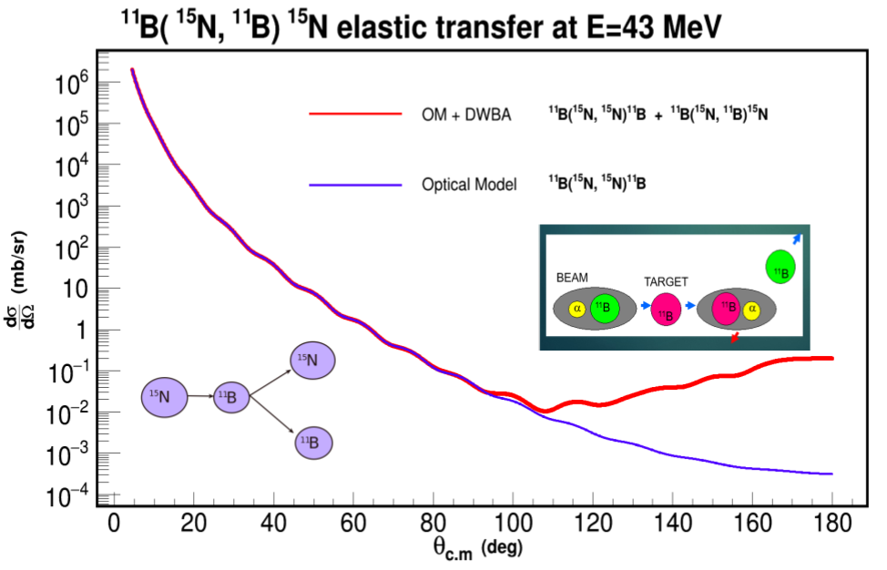

.. Автозамены
.. |empty| unicode:: U+2063
.. |theta| unicode:: U+03F4
.. |alpha| unicode:: U+03B1
.. |phi|   unicode:: U+03C6

Постановка задачи упругого рассеяния
------------------------------------

Ион **А** с энергией \ :sup:`A`\ **E**\ :sub:`0`, импульсом \ :sup:`A`\ **P**\ :sub:`0`\(**P**\ :sub:`x`, **P**\ :sub:`y`, **P**\ :sub:`z`),
начальными пространственными координатами \ :sup:`A`\ **r**\ :sub:`0`\(**x**\ :sub:`0`, **y**\ :sub:`0`, **z**\ :sub:`0`) налетает на покоящуюся мишень
состоящую из атомов **B**.
Ион **A** многократно рассеивается внутри обьема мишени, на некотором шаге выбивает ион **B**, и далее уже оба иона многократно рассеиваютя пока не покинут обьем мишени.
В результате - новые характеристики \ :sup:`A`\ **E**\, \ :sup:`A`\ **P(P**\ :sub:`x`, **P**\ :sub:`y`, **P**\ :sub:`z`), \ :sup:`A`\ **r(x**, **y**, **z**)- для иона **А**,
и следующие для иона **B**: \ :sup:`B`\ **E**\, \ :sup:`B`\ **P(P**\ :sub:`x`, **P**\ :sub:`y`, **P**\ :sub:`z`), \ :sup:`B`\ **r(x**, **y**, **z**).

.. figure:: _static/fig1.png
   :height: 600px
   :width: 600 px
   :align: center

Рассмотрим добавления упругого рассеяния в сессию симуляции на примере рассейния иона 15N на мишени 11B. Создаем класс коллекции взаимодействий и класс взаимодействия::

    ERDecayer* decayer = new ERDecayer();
    ERElasticScattering* scattering = new ERElasticScattering("15Nto15N11B");

15Nto15N11B - Имя взаимодействия.

Входные данные
--------------

Пользователь должен знать:

#. Следующие характеристики ионов:
    * A - атомная масса
    * Z - число протонов
    * Q - заряд

    Для налетающего иона, например для \ :sup:`15`\N, данные характеристике задаются так::

        scattering->SetInputIon(7,15,3); // Z = 7, A = 15, Q = 3

    А для иона мишени, например \ :sup:`11`\B так::

        scattering->SetTargetIon(5,11,5); // Z = 5, A = 11, Q = 5

#. Способ опредления кинематических характеристик. 

   По умолчанию, используется изотропное распределение угла рассеяния |theta|.
   
   Возможно задание кумулятивной функции распределения:

    Задаём имя текстового файла с данными о кумулятивной функции::

        scattering->SetThetaCDF("cos_tetta_cross.txt");

    Структура текстового файла должна быть следующая::

        4.5 0.0448573496944
        4.6 0.087071447189
        4.7 0.126858356665
        4.8 0.164410246312
        4.9 0.199891413123
        5.0 0.233459173925
        5.1 0.26523651571
        5.2 0.295359837723

        ... ...

        179.3 0.99999999789
        179.4 0.999999998493
        179.5 0.999999998995
        179.6 0.999999999397
        179.7 0.999999999698
        179.8 0.999999999899
        179.9 1.
        180.0 1.

    Где первый столбец соответствует углам |theta| в системе центра масс, а второй — значениям кумулятивной функции для данных значений углов |theta|.
    Текстовый файл с данными о кумулятивной функции должен лежать в директории **er/input** .

#. Способ определения координаты взаимодейсвия.

    * Для изотропного розыгрыша координаты взаимодействия внутри объёма мишени. Задать переднюю координату мишени и заднюю относительно глобальной оси **z**: ::

        scattering->SetUniformPos(-0.00035,0.00035);

      .. tip:: Использовать в случае **тонкой** мишени.

    .. figure:: _static/fig2.png
        :height: 600px
        :width: 600 px
        :align: center

        Обычно мишень располагается в начале глобальной системы координат, данный рисунок иллюстрирует этот случай.

    * Для экспоненциального розыгрыша координаты взаимодействия, используйте метод::

        SetExponentialPos(Double_t start, Double_t tau);

      .. tip:: Использовать в случае **толстой** мишени.

#. Точность необходимую для определения положение координаты взаимодейсвия. 

   Для этого здаем шаг пропогации внутри обьема мишени::

    scattering->SetStep(0.00001); //0.1 micron

#. Способ выбора диапозона розыгрыша углов |theta|\ :sub:`CM` и |phi|\ :sub:`CM` .
   
   По умолчанию |theta|\ :sub:`CM` разырывается внутри диапозона от 0\ :sup:`0` до 180\ :sup:`0` ,а  |phi|\ :sub:`CM` от 0\ :sup:`0` до 360\ :sup:`0` .
   Часто, пользователю не нужен весь диапозон розыгрыша углов для продуктов реакции, и он может выбрать только часть диапозона.
   
   Тогда продукты реакций будут рассеиваться под углами из выбранного диапозона, что уменьшит время вычисления и повысит статистику.
   
   * Выбрать диапозон розыгрыша для |theta|\ :sub:`CM` можно:
   
    #. Явным образом::

            scattering->SetThetaRange(18.4, 19.4);
            
       
    #. Через следующие величины:
    
        * Координату |theta|\ :sub:`Lab`\  центра щели детектора
            
        * *Полуширину* выбираемого диапозона 0.5*d |theta| в лабороторной системе координат::
             
            scattering->SetDetectorsSlot(thetaCenter, dTheta);

          .. attention:: Важно выбирать полуширину с запасом
                     
          Далее по формулам, которые приведены ниже расчитываются: |theta|\ :sub:`CM1` и |theta|\ :sub:`CM2`,
          где |theta|\ :sub:`CM1` и |theta|\ :sub:`CM2` крайние значения расчитываемого диапозона.

         Когда M\ :sub:`1`\ < M\ :sub:`2`\

          .. math::

           0 \leqslant \theta_1 \leqslant \pi\ ,\\

         а когда  M\ :sub:`1`\ > M\ :sub:`2`\

          .. math::

           0 \leqslant \theta_1 \leqslant \theta_{1max} \leqslant \frac{\pi}{2}\ ,\\

         в обоих случаях:

          .. math::

           \theta_{cm1} = \arccos\left [  -\frac{M_1}{M_2} + sin^2(\theta_1-d\theta) + cos(\theta_1-d\theta)\sqrt{1 - \frac{M_1^2}{M_2^2}sin^2(\theta_1-d\theta)} \right  ]\ ,
           
           \theta_{cm2} = \arccos\left [  -\frac{M_1}{M_2} + sin^2(\theta_1+d\theta) + cos(\theta_1+d\theta)\sqrt{1 - \frac{M_1^2}{M_2^2}sin^2(\theta_1+d\theta)} \right  ]\ .

         Когда M\ :sub:`1`\ = M\ :sub:`2`\

          .. math::

           0 \leqslant \theta_1 \leqslant \frac{\pi}{2}\ ,\\

          .. math::

           \theta_{cm1} = 2(\theta_1-d\theta) ,
           
           \theta_{cm2} = 2(\theta_1+d\theta) .

         Для первоначально покоивышихся частиц (во всех случаях):

          .. math::

           \theta_{cm1} = \pi - 2(\theta_2-d\theta) , 
                      
           \theta_{cm2} = \pi - 2(\theta_2+d\theta) .
        
         M\ :sub:`1` - масса налетающей частицы,
        
         M\ :sub:`2` - масса покоящейся частицы,
        
         |theta|\ :sub:`1` - угол рассеяния налетающей частицы (Лаб. Сит.),
        
         |theta|\ :sub:`2` - угол вылета покоящейся частицы (Лаб. Сит.).
         
         d |theta| - полуширина выбираемого диапозона (Лаб. Сит.).
         
  .. tip::
       Задавать диапозон розыгрыша через координату |theta|\ :sub:`Lab`\  центра щели детектора и 
       полуширину выбираемого диапозона d |theta| предпочтительнее т.к оба параметра в Лаб. Сист!
       
  * Диапозон розыгрыша для |phi| выбирается явно::
        
        scattering->SetPhiRange(-20., 20.);
        
Механизм работы класса
----------------------

Добавляем упругое рассеяние в коллекцию распадов::

  decayer->AddDecay(scattering);

Ниже опишем что будет происходить после этого.

Класс ElasticScattering содержит два основных метода: Intit(), Stepping().

Bool_t ElasticScattering::Init()
~~~~~~~~~~~~~~~~~~~~~~~~~~~~~~~~

Данный метод вызывается в самом начале симуляции, на этапе инициализации.
Здесь проверяется ::

    if (!ERDecay::Init())
    {
        return kFALSE;
    }

    fTargetIonPDG = TDatabasePDG::Instance()->GetParticle(fTargetIonName);
    if ( ! fTargetIonPDG )
    {
        LOG(FATAL) << "Target ion not found in pdg database!" << FairLogger::endl;
        return kFALSE;
    }

Расчитывается диапозон розыгрыша углов |theta|\ :sub:`CM`\  - вызовом метода::

    ERElasticScattering::RangesCalculate(Doubleр_t iM, Double_t tM)

где iM - масса налетающего иона, а tM - иона мишени.

.. note:: В случае явного определения диапозона розыгрыша |theta|\ :sub:`CM`\ , метод описанный выше не вызывается!

Так же здесь формируется кумулятивная функция. Из диапозона |theta|\ :sub:`CM`\  вычисляется соотвесвующий диапозон внутри кумулятивной функции.

Bool_t ElasticScattering::Steping()
~~~~~~~~~~~~~~~~~~~~~~~~~~~~~~~~~~~

Вызывается на каждом шаге траспорта налетающего иона внутри обьема мишени.

Здесь разыгрываются углы вылета для ионов - налетающего и мишени, следующим образом::

    // Generate random angles theta and phi
    Double_t theta = ThetaGen();
    Double_t phi = fRnd->Uniform(fPhi1*DegToRad(), fPhi2*DegToRad());

Затем ионы с новыми храктеритиками кидаются в стек частиц для дальгейшего траспорта.

Связь лабороторной и цетра масс систем
~~~~~~~~~~~~~~~~~~~~~~~~~~~~~~~~~~~~~~

.. figure:: _static/fig4.png
    :height: 600px
    :width:  600 px
    :align: center

На рисунке выше ион А упруго рассеивается на ионе B. В имплементации метода ElasticScattering::Steping() углы |theta|\ :sub:`CM`\ 
\  разыгрываются в системе координат (на рис. выше выделена красным) у которой ось z` направлена вдоль импульса первичного иона. 
Необходимо  повернуть систему координат (2) так что бы ее ось z` совпала с осью z`` из (3).
С помощью матодов TLorentzVector::

    TLorentzVector::RotateZ(-phi);
    TLorentzVector::RotateY(theta);
    TLorentzVector::RotateZ(phi);

В стек частиц упруго рассеявшияся ионы необходимо передать с характеристиками в лабороторной системе координат: Px, Py, Pz и E - энергия.
Для перехода из системы центра масс в лабороторную используется Boost::

    TLorentzVector::Boost(TVector3 &);
    
Подробнее об этом можно прочесть здесь: https://root.cern/doc/v616/classTLorentzVector.html

Пример
------

Рассмотрим пример по моделированию уругого рассеяния\ :sup:`15`\ N на \ :sup:`11`\ B.

Сущесвует два наиболее вероятных механизма согласно которому будет протекать данная реакция.

    

