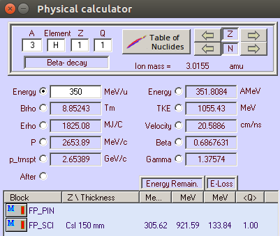
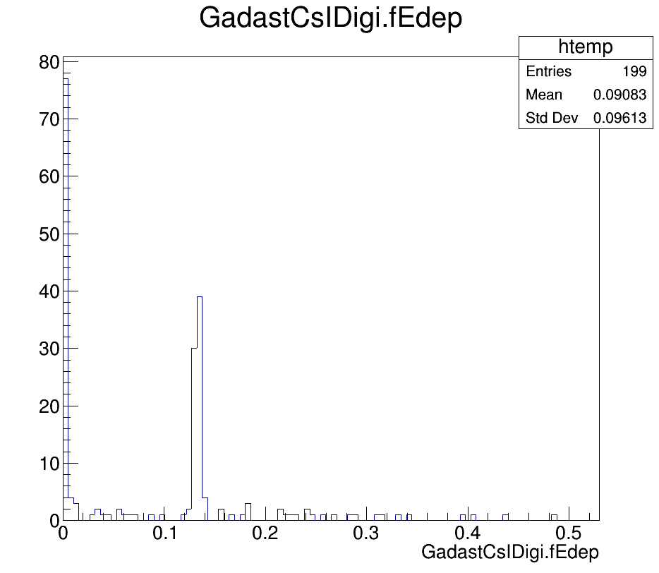
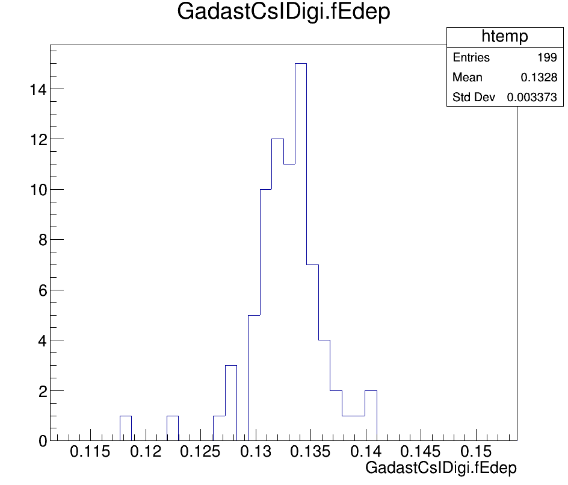
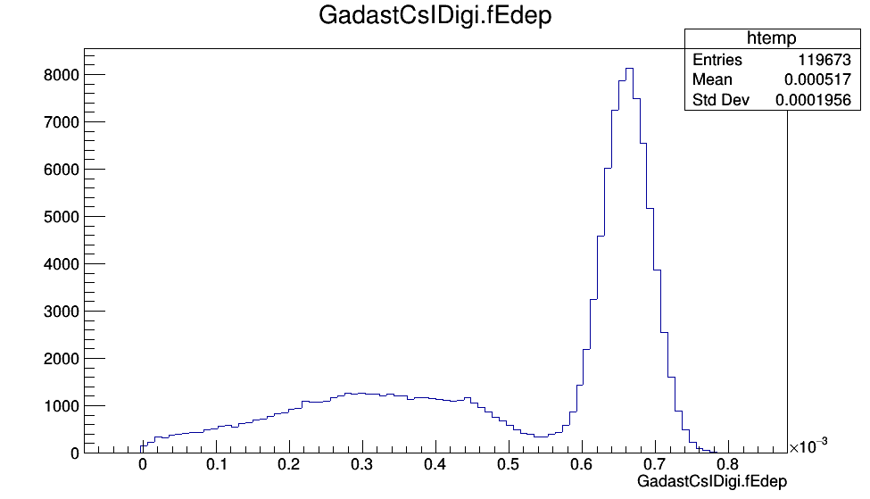
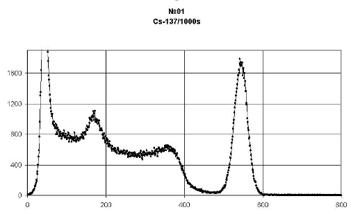

Gadast
======

Simulation
----------

Digitization
------------

Reconstruction
--------------

QA
--
Для проверки корректности данных на выходе из диджитизации сравним энергопотери (Edep) в кремниевой пластине, получаемые в пакете ExpertRoot с аналогичными данными, расчитанными в LISE++ (http://lise.nscl.msu.edu/lise.html).
Пусть генератор ионов испускает тритий 3H с кинетичекой энергией 350 МэВ/нуклон в ячейку CsI детектора Gadast толщиной 150 мм. 
Соотвествующие настройки физического калькулятора LISE++ (в разделе программы Calculations -> Calculators -> Physical Calculator):

       Рисунок N. LISE++ Edep: тритий с кинетической энергией 350 МэВ/нуклон, налетающий на CsI ячейку Gadast толщиной 150 мм

В окне калькулятора в поле eLoss видно, что энергопортери равны 133.84 МэВ.

Гистограмма рапределения Edep в результате диджитизации в ER с аналогичными входными данными для 100 событий, без введения коэффициентов размытия параметров энергии и времени в дидитизации:

       Рисунок N. ER Edep: тритий с кинетической энергией 350 МэВ/нуклон, налетающий на CsI ячейку Gadast толщиной 150 мм

Отмасштабированный вариант гистограммы в области 130 МэВ:

       Рисунок N. ER Edep: тритий с кинетической энергией 350 МэВ/нуклон, налетающий на CsI ячейку Gadast толщиной 150 мм

Среднее значение на гистограмме равно приблизительно 132.8 МэВ. Различие между результатами LISE++(2.5668 МэВ) и ER(2.48 МэВ) обусловлено, в данном случае, тем, что в LISE++ масса иона вычисляется с помощью атомной единицы массы (AMU), а в ER - с помощью массы протона.

Еще одна проверка гамма-детектора Gadast. Получим гамма-спектр для Cs137. Для этого направим пучок гамма-квантов 661.7 кэВ на модуль CsI детектора Gadast. Соответствующие параметры генератора:

::

  Int_t pdgId = 22; // gamma 22
  Double32_t kin_energy = .6617 * 1e-3; // GeV // Энергия гамма от Cs137 = 661.7 кэВ
  FairPrimaryGenerator* primGen = new FairPrimaryGenerator();
  FairBoxGenerator* boxGen = new FairBoxGenerator(pdgId, 1);
  Double_t mass = TDatabasePDG::Instance()->GetParticle(pdgId)->Mass();
  Double32_t momentum = TMath::Sqrt(kin_energy*kin_energy + 2.* kin_energy*mass); //GeV
  boxGen->SetPRange(momentum, momentum);
  boxGen->SetThetaRange(0., 0.); // 0-90
  boxGen->SetPhiRange(0., 0.); // 0-360
  boxGen->SetBoxXYZ(0., 0., 0., 0., -beamStartPosition); // xmin, ymin, xmax, ymax, z
  primGen->AddGenerator(boxGen);
  run->SetGenerator(primGen);

После диджитизации в случае 100000 событий и введении ошибки :math:`\frac{\sigma_{E}}{E}= \sqrt{(\frac{a}{E})^2 + (\frac{b}{\sqrt{E/GeV}})^2 + c^2}` :

::

  ERGadastDigitizer* digitizer = new ERGadastDigitizer(verbose);
  digitizer->SetCsIEdepError(0, 0.04, 0.01); // (a, b, c)
  fRun->AddTask(digitizer);

Получим спектр:

       Рисунок N. Гамма-спектр Cs137 в Gadast

Пик полного поглощения данного спектра похож на ожидаемый:

       Рисунок N. Гамма-спектр Cs137

