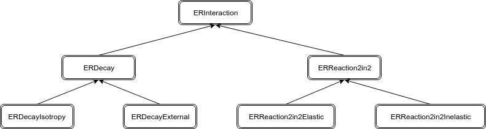

Interactions
============

В большинстве рассматриваемых физических экспериментов требуется восстановить параметры одного из продуктов взаимодействия
по параметрам первичного иона и продуктов, наблюдаемых в детекторах.

Для физики низких энергий критически важна точность определения параметров первичного иона перед взаимодействием.
Этот факт не позволяет начать моделирование с процесса транспорта продуктов, а требует детального рассмотрения
процесса пропагации первичного иона с учетом рассеяния и энергопотерь в детекторе пучка и мишени.

Необходимость использования специфических моделей взаимодействий и их каскадов делает невозможным 
использование Монте-Карло пакетов общего назначения:

* Geant (https://geant4.web.cern.ch/) ;
* Pythia  (http://home.thep.lu.se/~torbjorn/Pythia.html) .

Interactions - подсистема er, отвечающая за имплементацию моделирования реакций и распадов в
в общую схему процесса симуляций экспериментов, наследованную из пакета FairRoot.
Задачи Interactions можно разделить на две группы:

* Реализация довольно простых моделей взаимодействий: 
	
	* Реакции 2 в 2
	* Распады, изотропные в ЦМ

но с существенно кастомизированными для задач физики низких энергий возможностями их параметризации;

* Реализация интерфейса между программными пакетами генерации событий, построенными на сложных теоретических моделях, и процессом симуляции всего эксперимента.

Ниже приведем иерархию классов подсистемы Interacions.

ERInteraction
-------------

ERInteraction - базовый класс, предоставляющий общий интерфейс и общую функциональность для реализации взаимодействий в ExpertRoot.
На этом уровне иерархии классов находятся данные и функциоальность, которые необходимы как для реакций, так и для распадов:

Данные:

* PDG коды входа и всех выходов. Необходимы для определения энергии основного состояния и розыгрыша изотропного распределения импульсов;
* Способ определения координаты взаимодействия:

	* Распределение координаты(Uniform, Exponential)
	* Распределение энергии, до которой пропагируется первичный ион

* Параметры для идентификации координаты взаимодействия:

	* Объём геометрии, в котором происходит взаимодействие;
	* Шаг транспорта внутри объема взаимодействия;

* Способ разыгрывания кинематики: изотропное, неизотропное

Функциональноть:

* Проверка входых данных
* Проверка, делаем ли взаимодействие на данном шаге 
* Остановка входного трека
* Перевод выходов в лаб. СК
* Добавление выходов в стек треков

ERReaction2in2
++++++++++++++

* Неизотропное распределение theta по CDF из файла (в  заданных диапазонах theta и phi)

ERReaction2in2Elastic
+++++++++++++++++++++

* Реализация упругой реакции 2 в 2

ERReaction2in2Inelastic
+++++++++++++++++++++++

* Надо прописывать конкретную физику "неупругости" - спектр возбуждения и, если есть, угловую зависимость этого спектра.

ERDecay
+++++++

* Способ определения координаты взаимодействия:
	* Время жизни иона

ERDecayIsotropy
+++++++++++++++

* Распределение энергии возбуждения входа (Возможно несколько с весами)

ERDecayExternal
+++++++++++++++

* Чтение результатов распада в ЦМ из внешнего файла

Последовательности взаимодействий
---------------------------------

В ERInteraction реализованы два способа задания посдедовательности взаимодействий:

* Подразумеваем, что дочернее взаимодействие происходит сразу за родительским. В таком случае
продукт родительского взаимодействия, который является входом для дочернего не транспортируется - трек для него не создается.
В таком случае способ опредления координаты второго взаимодействия задавать не надо.

* Подразумеваем, что продукт родительского взаимодействия неободимо транспортировать.

Для имплементации последовательностей взаимодействий,
необходима реализация конструктора взаимодействия, 
в параметры которого входит другое взаимодействие, номер его
выхода и флаг необходимости транспорта промежуточного продукта.