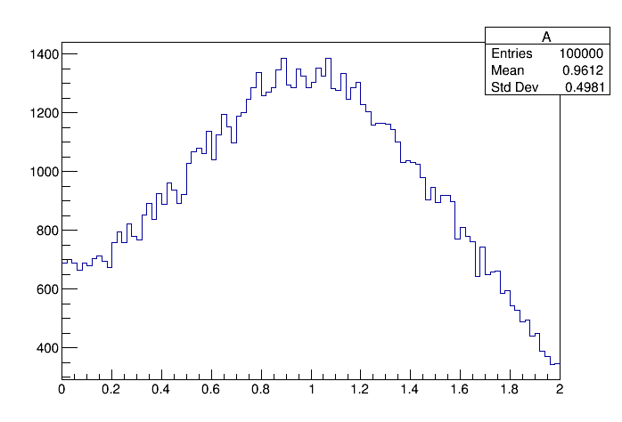
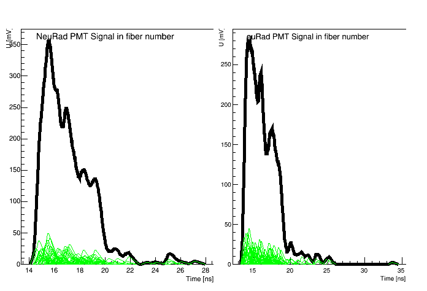
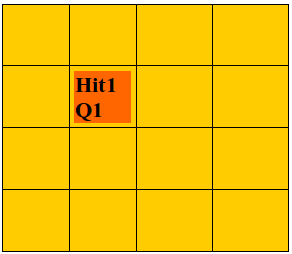
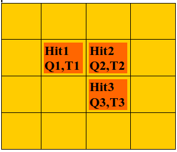

NeuRad
======

Детектор нейтронов NeuRad
-------------------------

Разрабатываемый детектор нейтронов NeuRad (аббревиатура от Neutron Radioactivity) предназначен для получения прецизионной информации об угловых корреляциях распадных нейтронов с заряженным фрагментом. Эта информация используется для определения энергии распада, происходящего вблизи мишени, и времени жизни экзотического ядра. Информация о направлении вылета тяжелого фрагмента поступает от кремниевого микрострипового детектора, а направления полета нейтронов должны быть получены с помощью специально изготовленного детектора NeuRad, обладающего высоким угловым разрешением. Необходимое угловое разрешение для нейтронов должно быть ~0,1-0.2 мрад. Покрываемый угловой диапазон ±6 мрад. Такой малый угловой диапазон отражает малый поперечный импульс, отвечающий энергии распада 0.1 кэВ – 100 кэВ.

Нейтрон – частица, не имеющая заряда и не способная ионизировать вещество. Поэтому нейтрон регистрируют косвенно. При попадании нейтрона в объём сцинтиллятора, происходит ядерная реакция выбивания заряженной частицы, в большинстве случаев протона, называемого протоном отдачи. Заряженная частица ионизирует сцинтиллятор, что приводит к появлению вспышки света. Порог чувствительности детектора к протонам отдачи должен быть не выше 1000 кэВ. Процедура реконструкции события должна позволять отличить взаимодействие двух распадных нейтронов от последовательных взаимодействий одного нейтрона и от фоновых взаимодействий гамма-излучения.

Детекторная система NeuRad имеет модульную структуру. Каждый модуль  состоит из сцинтилляционных оптических волокон квадратного сечения 3мм*3мм и системы считывания. Волокна собраны в пучок квадратного сечения, состоящий из 256 штук, и ориентированы вдоль пучка ионов, падающих на мишень. Прототип пучка волокон, состоящий из 64 штук, показан на рис.2.1. совместно с технологической оснасткой, использующейся при его изготовлении. 

.. figure:: _images/neurad_proto.png
       :scale: 100 %
       :align: center
       :alt: Альтернативный текст

       Рисунок 1. Пучок оптических волокон в специально разработанной технологической оправке

Для оптического считывания пучка волокон используются многоанодные фотоэлектронные умножители (МА ФЭУ), расположенные с двух сторон. Фотокатод МА ФЭУ разбит на 64 пикселя, к каждому из которых подходит четыре волокна. Фотоэлектроны из каждого пикселя попадают в свою секцию динодной системы, где развивается лавина, приходящая, в конце концов, на соответствующий анод. Имеется возможность считывания с последнего динода сигнала, пропорционального сумме сигналов во всех анодах. 

Принцип работы модуля упрощенно проиллюстрирован на рис. 2. Двустороннее считывание позволяет определить продольную координату места взаимодействия по разности задержек в приходе сигнала. В поперечном направлении точка прилета нейтрона определяется центром пикселя, в котором было зарегистрировано первое по времени взаимодействие.

.. figure:: _images/neurad_scheme.png
       :scale: 100 %
       :align: center
       :alt: Альтернативный текст

       Рисунок 2. Принцип действия NeuRad

Симуляция
---------

В задачи класса симуляции входит:

#. Транспорт всех частиц в событии через объём сцинтиллятора и разыгрывание происходящих с ними физических процессов, включающих ядерные и электромагнитные взаимодействия, в частности, потери энергии на ионизацию. 

#. Преобразование энерговыделения на каждом шаге  (dE_i  ,[MeV]) в величину той же размерности, но пропорциональную количеству рожденного света (dL_i,[MeV],), которое зависит не только от величины энерговыделения, но и от плотности ионизации, т.е. размера области пространства, в которой данное энерговыделение сосредоточено. Частицы с высокой плотностью ионизации (протоны, альфа-частицы, тяжёлые ионы, осколки деления) дают в большинстве сцинтилляторов меньшее количество фотонов, чем гамма-кванты, электроны или мюоны, потерявшие такую же энергию. 

Геометрия
~~~~~~~~~

Для моделирования используется правдоподобная геометрическая модель детектора NeuRad. Модель состоит из 49 модулей, расположенных квадратным массивом 7x7. Каждый модуль состоит из 64 волокон, также собранных в квадратный массив 8x8. К модулю с каждой стороны подключен многоанодный ФЭУ, каждое волокно с каждой стороны просматривается одним пикселем. Волокно имеет длину 1 м и квадратное сечение  6*6 мм2. Таким образом, одно волокно в модели соответствует четырем волокнам в реальном детекторе. Конец модуля, обращенный к мишени, т.е. расположенный выше по пучку будем называть фронтальным, а противоположный конец – задним.Материал сцинтиллятора задан как стехиометрический эквивалент полистирола. Наличие МА ФЭУ на торцах прибора моделируется прямоугольными  пластинами из алюминия толщиной 2.4 мм.

NeuRad.geo.root
"""""""""""""""

Геометрическая модель одного модуля детектора NeuRad.

Формирование поинта
~~~~~~~~~~~~~~~~~~~
Алгоритм симуляции проведения частиц через детектор NeuRad реализован в методе ERNeuRad::ProcessHits(FairVolume* vol). Данный метод вызывается на каждом шаге работы VirtualMC, если шаг находится внутри активного объема детектора NeuRad. Активные объемы задаются в методе ERNeuRad::CheckIfSensetive(std::string name). 

Результатом работы всех вызывов  ERNeuRad::ProcessHits  является коллекция объектов класса ERNeuRadPoint. Поинт - прямолинейный отрезок энерговыделения в одном объёме, депозит энергии которого привысил порог. Порог на депозит энергии поинта в NeuRad равен нулю. 

Кроме стандартной для поинта характеристики Energy Loss, вычисляется Light Yield (световыход), величина которого определяется по закону Биркса. Параметризация закона Биркса взята из Geant4. Для имплементации закона Биркса введены следующие константы:

.. math::

   dP = 1.032

   BirkC1 = 0.013/dP

   BirkC2 = \frac{9.6*10^{-6}}{dP^2}

dP - имеет смысл плотности вещесва. Световыход на данном шаге вычисляется так:

.. math::

	dL = \frac{dE}{1+BorkC1*\frac{dE}{dx} + BirkC2*\frac{dE}{dx}^2}

dL- величина светоыхода на данном шаге транспорта, dE - величина депозита энергии на данном шаге, dx - длина шага. 

Предусмотрено изменение константы Биркса для случая высоко заряженных частиц: если энерговыделение оставляет частицца с зарядом больше 2 GeV, то 

 .. math::

 	BirkC1 = BirkC1 * 7.2/12.6

Световыход поинта определяется как сумма световыходов на  всех шагах VirtualMC, формирующих поинт

.. math::
	E = \sum dE\ [GeV]

	L = \sum dL\ [GeV]

Для более точного расчёта времени прихода фотонов на катод, предусмотрен порог на длину поинта - 4 см. Когда накопленная длина поинта превысила порог, начинает формироваться новый поинт.

Диджитизация
------------

Задачей диджитизации является формирование формы сигнала на выходе фотокатода. Для этого моделируются следующие процессы:

1. Рождение фотонов: 

.. math::
	Np = L * C_{SciFi}

где :math:`C_{SciFi}` – световыход сцинтиллятора, т.е. количество фотонов, рожденных на один МэВ энергопотерь электрона. Для сцинтилляционных волокон Saint-Gobain BCF -12, используемых в NeuRad,  :math:`C_{SciFi}=8000\ [\frac{photons}{MeV}]`.

2. Учитываются две причины зависимости количества фотонов, достигших фотокатода, от продольной координаты точки взаимодействия: телесный угол, под которым виден фотокатод из точки взаимодействия с учетом полного внутреннего отражения – быстро спадающая экспонента с характерной длиной 0.5 см, и поглощение света в материале волокна – экспонента с характерной длиной 2м. Соответствующие выражения имеют вид:

.. math::
	N_p^f= N_p(k_1exp⁡(-Z_{fiber}/0.5)+k_2exp⁡(-Z_{fiber}/200));

	N_p^b= N_p(k_1exp⁡(-(l-Z_{fiber})/0.5)+k_2exp⁡(-(l-Z_{fiber}/200));

	k_2=C_{lftr};
	
	k_1=0.5-C_{lftr};

где :math:`C_{lftr}`- константа захвата света в угол полного внутреннего отражения света (light fraction in total reflection), Z_fiber [cm]- расстояние от фотокатода до места энергвыделения, :math:`N_p^f,N_p^b` – количество фотонов пришедших на фронтальный и задний пиксели соответственно.

3. 	Рассчитывается, учитывая квантовую эффективность, среднее число родившихся на каждом пикселе фотоэлектронов :math:`\hat{N_{pe}}` для данного энерговыделения:

.. math::
  N_{pe} = N_p*C_{qe},

где  :math:`C_{qe}` –квантовая эффективность фотокатода. :math:`C_{qe}` берётся из таблицы квантовых эффективностей по индексу волокна и модуля (:math:`C_{qe} \approx 20%`). 

4. Количество родившихся в событии фотоэлектронов разыгрывается по закону Пуассона со средним :math:`\hat{N_{pe}}`:

.. math ::

  N_{pe}= P(\hat{N_{pe}}),

где P(∙)-функция распределения Пуассона. Высвечивание фотонов происходит по экспоненциальному закону с характерным временем  :math:`\tau_{sci}=3.2 нс`:
  
.. math::

  N_p(t)=1-exp⁡(\frac{-t}{\tau_{sci}}),

где :math:`N_p(t)` – количество фотонов, высвеченных за время t. Для моделирования каждого фотоэлектрона необходимо знать время прихода соответствующего фотона на катод. Для этого найдем функцию обратную (2.6) и подадим ей в качестве аргумента равномерное распределение. 

.. math::

  T_k=T_{edep}+(-1)*\tau_{sci}*log⁡(1-U[0:1])+Z_{fiber}/С_{sc},

где  :math:`T_{edep}` – время соответствующего энерговыделения, второе слагаемое – время до высвечивания данного фотона, определяемое обратным экспоненциальным распределением, U[0:1] – равномерное распределение, :math:`С_{sс}` – скорость света в материале сцинтиллятора (n=1.58).

5. Амплитуда одноэлектронного сигнала :math:`A_{pe}`, рассчитывается как: 
  
.. math:: 
  A_{pe}=\mid N(A,\sigma) \mid, 

где :math:`N(A,\sigma)` – функция нормального распределения c подобранными параметрами A и  :math:`\sigma`. Cреднее значение распределения амплитуд :math:`A_{pe}` нормировано на единицу для возможности выражения всех порогов в фотоэлектронах. Формула моделирует распределение, показанное на рис.3. 

       Рисунок 3. Распределение амплитуды одноэлектронного сигнала

6. Время прихода сигнала на анод рассчитывается как:

.. math::

  T_a=T_k+N(D_{PMT},J_{PMT}),

где :math:`D_{PMT}` – задержка на динодной системе, :math:`J_{PMT}` -  флуктуация времени прохождения электронной лавины через динодную систему.
  
Получив параметры сигналов фотоэлектронов :math:`A_{pe}\ и\ T_a`, можно ввести функцию формы сигнала параметризованную на них. Была предложена следующая функция сигнала фотоэлектрона:

.. math::

  A(t)=T_a+ a*A_{pe}*T_aexp⁡(-T_a/b),

где a и b – коэффициенты для настраивания формы. Они определяются для ФЭУ из эксперимента. Характерный график такой зависимости в условных единицах без начального сдвига представлен на рис. 

.. figure:: _images/ope_signal.png
       :scale: 50 %
       :align: center
       :alt: Альтернативный текст

       Рисунок 4. Форма одноэлектронного сигнала

7. Получив формы сигналов от каждого фотоэлектрона, можно получить суммарный токовый сигнал на аноде как:

.. math::

  Aa_j(t)=\sum_{i=1}^{N_{pe}} A_i(t)

где :math:`N_{pe}` – количество фотоэлектронов, рожденных от света на одном пикселе, i – индекс фотоэлектрона, попавшего в динодную систему данного анода, j – индекс анода (волокна). Результат моделирования формы сигнала с двух сторон сцинтилляционного волокна представлен на рис.2.7. 

       Рисунок 5.Суммарные сигналы с двух сторон волокна

8. При расчёте сигнала с общего динода учитываются коэффициенты усиления: 

.. math::
  Ad_j(t)=Aa_j(t)*Cg_j,

где  :math:`Cg_j`- коэффициент усиления динодной системы, который берётся из таблицы коэффициентов по индексу модуля и волокна.
  
9. Также реализуется система кросстолков, моделирующая перетекание сигнала между анодами многоанодного ФЭУ.

Реконструкция
-------------

Задача NeuRad – обнаружить точку входа нейтрона в детектор. Под реконструкцией события будем подразумевать идентификацию волокна, в которое влетел нейтрон. За координаты попадания нейтрона будем принимать координаты центра этого волокна. Задачу осложняет, то что ионизация, вызванная выбитыми из ядра сцинтиллятора частицами, происходит не только в объёме волокна, в который попал нейтрон, но и в соседних. В результате сигнал появляется на кластере пикселей. 

Поэтому для NeuRad предусмотрены два режима работы:

1. Однофайберный режим. На каждый пиксель ставится порог на интеграл сигнала (:math:`T_p`). Рассматриваются только те события, в которых этот порог с обоих концов преодолен только на одном из волокон.  В этом режиме временная информация сигнала не учитывается. Порог вводится на интеграл импульса тока, т.е. заряд, как:

.. math::

  \begin{equation*}
   \begin{cases}
     Q_j^{front}=\int_{t}^{t+5[нс]}Aa_j^{front}(t)dt  >T_p 
     \\
      Q_j^{back}=\int_{t}^{t+5[нс]}Aa_j^{back}(t)dt >T_p
   \end{cases}
  \end{equation*}

где :math:`A_{PMT}^{front}(t),A_{PMT}^{back}(t)`  - сигналы на фронтальном и заднем пикселе соответственно, :math:`t \in [T_a,T_a+T_s], T_a=min⁡((T_a)_i),T_s` – продолжительность сигнала, численно определяемая, как конечная точка сигнала последнего одноэлектрона. Порог :math:`T_p` вводится в единицах фотоэлектронов, умноженных на интеграл сигнала одного фотоэлектрона.

2. Многофайберный режим. На каждый фронтальный  пиксель ставится порог на мгновенный уровень сигнала. Момент времени, когда этот порог преодолен, служит временной отметкой (time stamp) данного пикселя. Отбираются события, в которых порог преодолен хотя бы на одном из фронтальных пикселей во всем детекторе. Затем отбираются события, в которых сумма интегралов динодных сигналов обоих МА ФЭУ какого-либо модуля преодолела порог :math:`T_M`. Считается, что нейтрон попал в волокно, фронтальный пиксель которого загорелся раньше остальных. Систему поставленных порогов в данном режиме можно описать так:

.. math::

  \begin{equation*}
     \begin{cases}
        Aa_j^{front}(t)>T_p 
        \\
        \sum_{j=1}^{M} \int_{t}^{t+5[нс]}Ad_j^{front}(t)dt+\sum_{j=1}^{M} \int_{t}^{t+5[нс]} Ad_j^{back}(t)dt >T_M,
    \end{cases}
  \end{equation*}

где М – количество волокон в модуле, :math:`t \in [T_a,T_a+T_s]`, порог :math:`T_p` в этом режиме вводится в единицах одноэлектронных амплитуд, порог :math:`T_M` – в единицах фотоэлектронов, у множенных на интеграл сигнала одного фотоэлектрона. :math:`Ad_j` посчитан по формуле 2.12.
Результатом работы алгоритма реконструкции в детекторе NeuRad является хит – т.е  предположительная точка, где нейтрон влетел в детектор. 
 
В однофайберном режиме хитом служит центр единственного пикселя, где выполнено условие 2.12. В многофайберном режиме центр каждого переднего пикселя, в котором выполнено условие 2.13, является кандидатом в хиты, а хитом оказывается тот из них, в котором timestamp имеет наименьшее значение 

       Рисунок 6. Результаты работы однофайберного и многофйберного режима

Пучковые тесты
--------------

