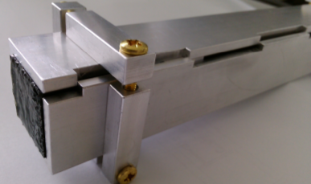
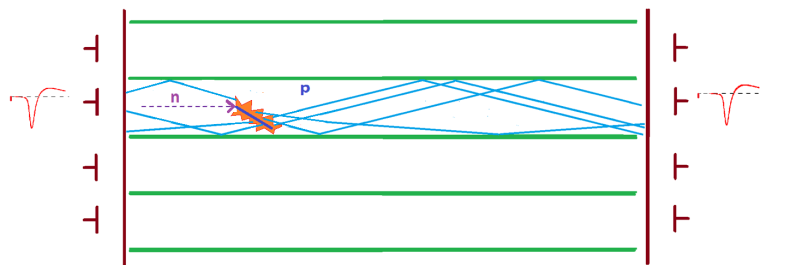

NeuRad
======

Детектор нейтронов NeuRad
-------------------------

Разрабатываемый детектор нейтронов NeuRad (аббревиатура от Neutron Radioactivity) предназначен для получения прецизионной информации об угловых корреляциях распадных нейтронов с заряженным фрагментом. Эта информация используется для определения энергии распада, происходящего вблизи мишени, и времени жизни экзотического ядра. Информация о направлении вылета тяжелого фрагмента поступает от кремниевого микрострипового детектора, а направления полета нейтронов должны быть получены с помощью специально изготовленного детектора NeuRad, обладающего высоким угловым разрешением. Необходимое угловое разрешение для нейтронов должно быть ~0,1-0.2 мрад. Покрываемый угловой диапазон ±6 мрад. Такой малый угловой диапазон отражает малый поперечный импульс, отвечающий энергии распада 0.1 кэВ – 100 кэВ.

Нейтрон – частица, не имеющая заряда и не способная ионизировать вещество. Поэтому нейтрон регистрируют косвенно. При попадании нейтрона в объём сцинтиллятора, происходит ядерная реакция выбивания заряженной частицы, в большинстве случаев протона, называемого протоном отдачи. Заряженная частица ионизирует сцинтиллятор, что приводит к появлению вспышки света. Порог чувствительности детектора к протонам отдачи должен быть не выше 1000 кэВ. Процедура реконструкции события должна позволять отличить взаимодействие двух распадных нейтронов от последовательных взаимодействий одного нейтрона и от фоновых взаимодействий гамма-излучения.

Детекторная система NeuRad имеет модульную структуру. Каждый модуль  состоит из сцинтилляционных оптических волокон квадратного сечения 3мм*3мм и системы считывания. Волокна собраны в пучок квадратного сечения, состоящий из 256 штук, и ориентированы вдоль пучка ионов, падающих на мишень. Прототип пучка волокон, состоящий из 64 штук, показан на рис.2.1. совместно с технологической оснасткой, использующейся при его изготовлении. 

       Рисунок 1. Пучок оптических волокон в специально разработанной технологической оправке

Для оптического считывания пучка волокон используются многоанодные фотоэлектронные умножители (МА ФЭУ), расположенные с двух сторон. Фотокатод МА ФЭУ разбит на 64 пикселя, к каждому из которых подходит четыре волокна. Фотоэлектроны из каждого пикселя попадают в свою секцию динодной системы, где развивается лавина, приходящая, в конце концов, на соответствующий анод. Имеется возможность считывания с последнего динода сигнала, пропорционального сумме сигналов во всех анодах. 

Принцип работы модуля упрощенно проиллюстрирован на рис. 2. Двустороннее считывание позволяет определить продольную координату места взаимодействия по разности задержек в приходе сигнала. В поперечном направлении точка прилета нейтрона определяется центром пикселя, в котором было зарегистрировано первое по времени взаимодействие.

       Рисунок 2. Принцип действия NeuRad

Симуляция
---------

Геометрия
~~~~~~~~~

Для моделирования используется правдоподобная геометрическая модель детектора NeuRad. Модель состоит из 49 модулей, расположенных квадратным массивом 7x7. Каждый модуль состоит из 64 волокон, также собранных в квадратный массив 8x8. К модулю с каждой стороны подключен многоанодный ФЭУ, каждое волокно с каждой стороны просматривается одним пикселем. Волокно имеет длину 1 м и квадратное сечение  6*6 мм2. Таким образом, одно волокно в модели соответствует четырем волокнам в реальном детекторе. Конец модуля, обращенный к мишени, т.е. расположенный выше по пучку будем называть фронтальным, а противоположный конец – задним.Материал сцинтиллятора задан как стехиометрический эквивалент полистирола. Наличие МА ФЭУ на торцах прибора моделируется прямоугольными  пластинами из алюминия толщиной 2.4 мм.

NeuRad.geo.root
"""""""""""""""

Геометрическая модель одного модуля детектора NeuRad.

Формирование поинта
~~~~~~~~~~~~~~~~~~~
Алгоритм симуляции проведения частиц через детектор NeuRad реализован в методе ERNeuRad::ProcessHits(FairVolume* vol). Данный метод вызывается на каждом шаге работы VirtualMC, если шаг находится внутри активного объема детектора NeuRad. Активные объемы задаются в методе ERNeuRad::CheckIfSensetive(std::string name). 

Результатом работы всех вызывов  ERNeuRad::ProcessHits  является коллекция объектов класса ERNeuRadPoint. Поинт - прямолинейный отрезок энерговыделения в одном объёме, депозит энергии которого привысил порог. Порог на депозит энергии поинта в NeuRad равен нулю. 

Кроме стандартной для поинта характеристики Energy Loss, вычисляется Light Yield (световыход), величина которого определяется по закону Биркса. Параметризация закона Биркса взята из Geant4. Для имплементации закона Биркса введены следующие константы:

.. math::

   dP = 1.032

   BirkC1 = 0.013/dP

   BirkC2 = \frac{9.6*10^{-6}}{dP^2}

dP - имеет смысл плотности вещесва. Световыход на данном шаге вычисляется так:

.. math::

	dL = \frac{dE}{1+BorkC1*\frac{dE}{dx} + BirkC2*\frac{dE}{dx}^2} 

Предусмотрено изменение константы Биркса для случая высоко заряженных частиц: если энерговыделение оставляет частицца с зарядом больше 2 GeV, то 

 .. math::

 	BirkC1 = BirkC1 * 7.2/12.6

Световыход поинта определяется как сумма световыходов на  всех шагах VirtualMC, формирующих поинт.

Диджитизация
------------

