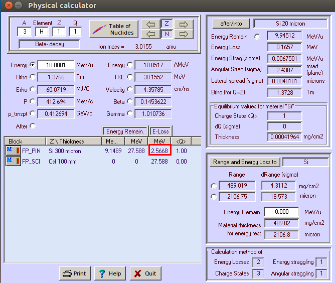
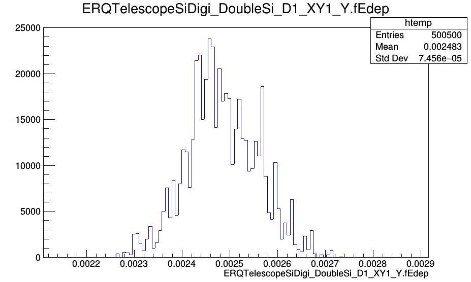

QTelescope
==========

Для проверки корректности данных на выходе из диджитизации сравним энергопотери (Edep) в кремниевой пластине, получаемые в пакете ExpertRoot с аналогичными данными, расчитанными в LISE++ (http://lise.nscl.msu.edu/lise.html).
Пусть генератор ионов испускает тритий 3H с кинетичекой энергией 10 МэВ/нуклон перепендикулярно кремниевой пластине толщиной 300 микрон. 
Соотвествующие настройки физического калькулятора LISE++ (в разделе программы Calculations -> Calculators -> Physical Calculator):

       Рисунок N. LISE++ Edep: тритий с кинетической энергией 10 МэВ/нуклон, налетающий на кремниевую пластину толщиной 300 мкм

В окне калькулятора в поле eLoss видно, что энергопортери равны 2.5668 МэВ.

Гистограмма рапределения Edep в результате диджитизации в ER с аналогичными входными данными для 1000 событий, без введения коэффициентов размытия параметров энергии и времени в дидитизации:

       Рисунок N. ER Edep: тритий с кинетической энергией 10 МэВ/нуклон, налетающий на кремниевую пластину толщиной 300 мкм

Среднее значение на гистограмме равно приблизительно 2.48 МэВ. Различие между результатами LISE++(2.5668 МэВ) и ER(2.48 МэВ) обусловлено, в данном случае, тем, что в LISE++ масса иона вычисляется с помощью атомной единицы массы (AMU), а в ER - с помощью массы протона.
