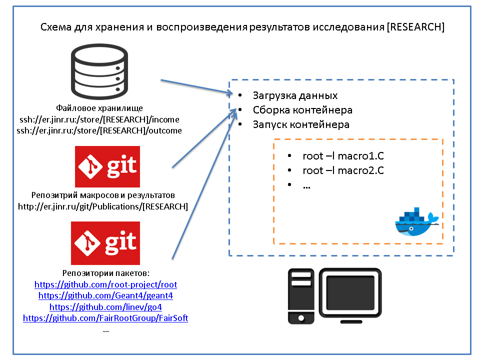

Simulation, Analisys and Data Managment System (SADMS)
======================================================

Одним из основных требований к результатам исследований является их воспроизводимость.

Для воспроизведения результатов исследования необходимо: 

* хранить файлы сырых данных;
* иметь доступ к программным пакетам, с помощью которых было проведено исследование, в том состоянии в котором они использовались;
* иметь доступ к макросам, с помощью которых конфигурировался весь процесс обработки и анализа полученных данных;
* иметь доступ к макросам конфигурации и запуска процессов симуляции, реконструкции и анализа симулированных данных, если такой проводился;
* иметь доступ к макросам, с помощью которых была полученна графическая информация результатов исследования.

Для удовлетворения данным требованиям:

* данные храняться в едином файлов хранилище: ssh://er.jinr.ru:/store/[RESEARCH];
* данные разделены на две директории для входных и выходных файлов исследования: ssh://er.jinr.ru:/store/[RESEARCH]/income, ssh://er.jinr.ru:/store/[RESEARCH]/outcome;
* все используемые программные пакеты и основные зависимости храняться в репозиториях с системами хранения версий;
* для унификации программного окружения (операционной системы, установленных в системе пакетов, ...) все программные пакеты с заданными ревизиями компилируются в `docker` контейнерах;
* весь процесс расчета и постпроцессинга результатов происходит в `docker` контейнере;
* все макросы, которые использовались в исследовании храняться в git репозитории http://er.jinr.ru/git/Publications/[RESEARH];
* в репозитории http://er.jinr.ru/git/Publications/[RESEARH] храниться Dockerfile с инструкциями сборки контейнера;
* в Readme.md файле исследования необходимо указать инструкцию по сборке контейнера с необходимыми входными файлами и макросами;
* в Readme.md файле исследования необходимо указать инструкцию по запуску макросов для получения результатов;

Общая схема
-----------

Общая схема SADMS представлена на рисунке. В нее входят файловое хранилище, git репозитории для исследований, git репозитории пакетов.

На машине на которой будут воспроизводиться результаты, собирается docker контейнер со всем необходимым и запускается. 
Внутри docker контейнера запускаются расчеты и макросы постпроцессинга результатов.

Все контейнеры обязаны иметь следующую структуру директориий:

::
	
	/home/user/income 
	/home/user/macro
	/home/user/outcome

Во время запуска контейнера в директорию `income` линкуются входные файлы, заранее загруженные из файлового ранилища; в директорию `macro` - репозиторий с макросами для исследования, склонированный из `http://er.jinr.ru/git/Publications/[RESEARH]`; в директорию `outcome` будут писаться выодные файлы.

В общем случае для воспроизведения необходимо будет выполнить следующую последовательность действий:

* Загрузить из файлового хранилища входные данные:

::
	
	mkdir [RESEARCH]
	scp -r user@er.jinr.ru:/store/[RESEARCH]/income [RESEARCH]

* Склонировать репозиторий с макросами исследования:

::

	git clone http://er.jinr.ru/git/Publications/[RESEARCH] [RESEARCH]/macro

* Создать директорию для выходных файлов

:: 

	mkdir [RESEARCH]/outcome

* Собрать контейнер по Dockerfile (в данном случае предпологаем, что Dockerfile лежит в репозитории с макросами):

::

	cd macro
	docker build - -t [RESEARCH]

* Запустить контейнер:

:: 

	docker run -it \     
	 	-v [RESEARCH]/income:/home/user/income
	 	-v [RESEARCH]/macro:/home/user/macro
	 	-v [RESEARCH]/outcome:/home/user/outcome
	 	-e DISPLAY=$DISPLAY \
        -v /tmp/.X11-unix:/tmp/.X11-unix \
        [RESEARCH]
        /bin/bash

В рамках данного действия директории на хосте, неободимые для исследования линкуются с директориями внутри контейнера; настраивается x11 forwarding для возможности запуска графики в контейнере и запускается командная строка.

Дальше можно запускать макросы. Все резальтаты, которые будут выгружены в файлы в `outcome` сохранятся на хосте.

Если исследование выполенено с помощью `er`
-------------------------------------------

В случае когда исследование выполенно с помощью `er` нет необходимости создавать свой Dockerfile. 
Dockerfile сборки er заднной ревизии с необходимыми зависимостями можно найти в репозитории |location link 1|.

.. |location link 1| raw:: html

  <a href="https://github.com/ExpertRootGroup/er_docker " target="_blank">er_docker</a> 

В репозитории с макросами для исследования в Readme.md необходимо только указать какую версию er и fairroot неободимо использовать в виде строки сборки контейнера:

::

	docker build --build-arg FAIRROOT=17.04 --build-arg ER=419b1db933f51a4480963b576e711301c4c100fc . -t er:[RESEARCH]

Все необходимые стандартные директории в контейнере уже созданы.

Docker образ er создается на базе Docker образа с fairroot, который в данной строке указан в переменной `FAIRROOT`. Его стоит заранее собрать по инструкциям |location link 1| или использовать контейнеры собранные на машине er.jinr.ru.

Для запуска контейнера:

::

	docker run -it \     
	 	-v [RESEARCH]/income:/home/jovyan/income
	 	-v [RESEARCH]/macro:/home/jovyan/macro
	 	-v [RESEARCH]/outcome:/home/jovyan/outcome
	 	-e DISPLAY=$DISPLAY \
        -v /tmp/.X11-unix:/tmp/.X11-unix \
        er:[RESEARCH]
        /bin/bash

После запуска проинициализировать er:

::
	
	. /opt/er/build/config.sh