.. |Ra226| replace:: \ :sub:`226`\ Ra
.. |alpha| replace:: :math:`\alpha`
.. |um| replace:: :math:`\mu m`

**********************************
Silicon strip detector calibration
**********************************

This section contains description of the Silicon Strip Detector (SSD) calibration using Ra226 alpha particle source.

.. contents:: Sections
   :local:
   :backlinks: top

Calibration algorithm
=====================

General assumptions
-------------------

The main assumptions the method is based:

#. Detector and readout system responses are linear

.. math::

   E = aN + b,

where :math:`E` -- energy in [eV] dimensionality, :math:`N` - readout value in ADC-channels count dimensionality, :math:`a` and :math:`b` - calibration coefficients;

#. Dead layer is uniform;
#. G4EmStandardPhysics description of |alpha|-particle energy losses in silicon is sufficient;
#. All |alpha|-particles are stopped in the detector.

Dead layer thickness estimation 
-------------------------------

|Ra226| |alpha|-particles source enables to perform calibration measures with several energies. In the under discussion method three lines are used: :math:`E_1`=4.7844 [MeV],  :math:`E_2`=6.0024 [MeV], :math:`E_3`=7.6869 [MeV].

Ionization losses depend on particle start energy and dead layer thickness which it passes through.

For the set of three spectrum lines, an energy losses of lines dependence on dead layer thickness can be characterized by the following dimensionless expression

.. math::

   \eta(d) = \dfrac{N_3 - N_2}{N_3 - N_1},

where :math:`N_1, N_2, N_3` - peak positions of spectrum lines in ADC-channel counts, coincident with :math:`E_1, E_2, E_3` energies in [MeV], and in linear calibration assumption it equals

.. math::

   \eta(d) = \dfrac{E_3 - E_2}{E_3 - E_1},

The figure 1 shows :math:`\eta(d)` dependence (in silicon equivalent of thickness) calculated using Geant4 G4EmCalculator class and program LISE++.

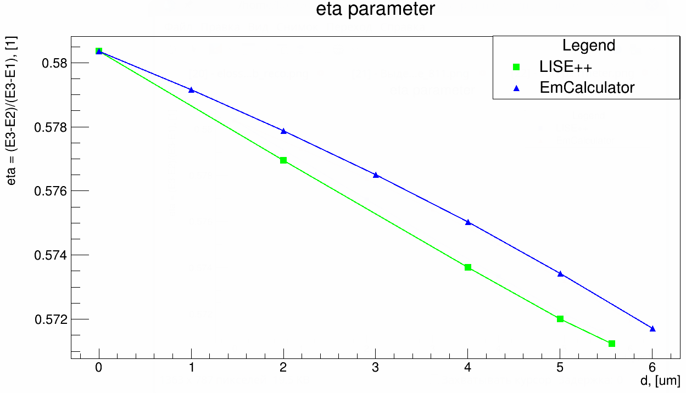

       Figure 1. Dependence :math:`d(\eta)`, calculated using G4EmCalculator and LISE++

For the calibration procedure the quadratic approximation of the :math:`d(\eta)` dependence shown in the figure 2 is used.

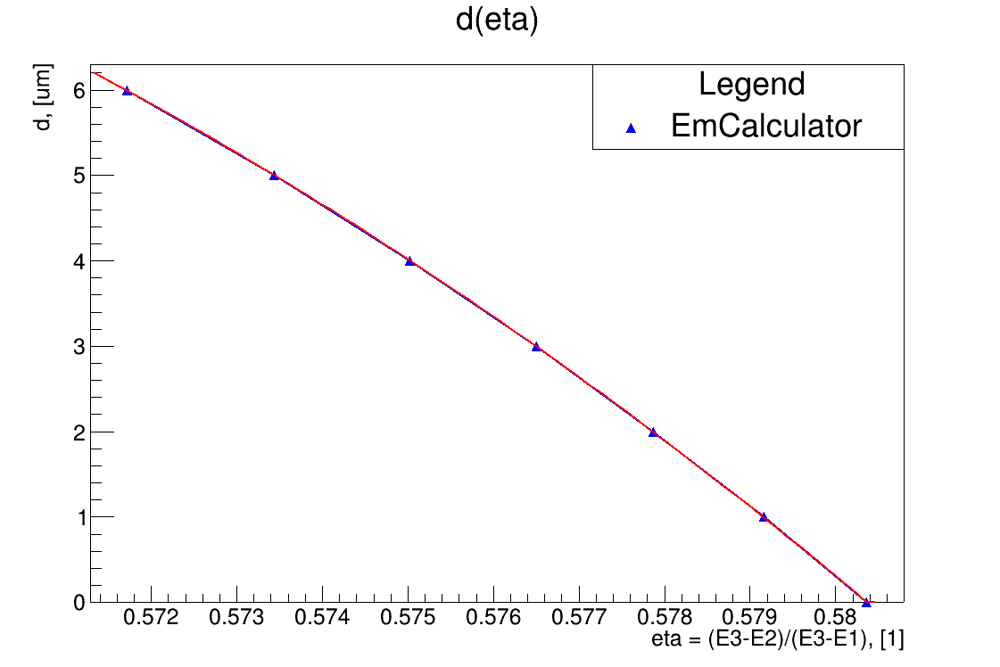

       Figure 2. Quadratic approximation of the :math:`d(\eta)` dependence

Approximation coefficients are listed in the table 1.

Table 1. Coefficients of the quadratic approximation :math:`d(\eta)=p_2 \eta^2 + p_1 \eta + p_0`

+-------------+-------------+-------------+
| :math:`p_2` | :math:`p_1` | :math:`p_0` |
+=============+=============+=============+
| 17102.8129  | 19011.5041  | -5272.9763  |
+-------------+-------------+-------------+

The typical form of the spectrum is shown in the figure 3.

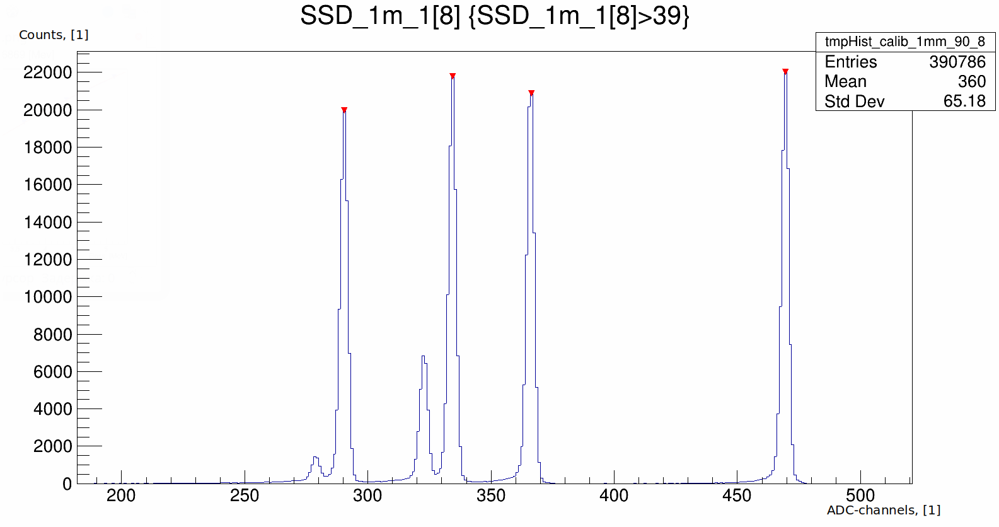

       Figure 3. Typical spectrum. Red markers - peaks positions found by TSpectum algorithm

Algorithms of peaks positions determination are described in the section :ref:`set-peak-search-algorithm-type`. The methodology of algorithm stability exploration is described in the section :ref:`calibration-stability-research`.

An accuracy of peak centroid position (RMS) determination by the 'sliding window' algorithm is about 0.05 ADC sampling step. In case of a large peak width accuracy goes downward. 

The inaccuracy of the dead layer estimation concerned with the peak searching algorithm inaccuracy is 0.24 [|um|] in case of the dead layer thickness about 2 [|um|]. The assumption about strips-wise dead layer uniformity enables to treat each strip dead layer as averaged over the whole sensor. The averaging leads to accuracy in dead layer determination up to 0.06 |um| (RMS). 

In the case of a thin detector (about 20 |um|), the full stop of alpha-lines is occurred when the sensor is rotated for a significant angle (65 degrees) with respect to direct source exposure.
An evaluated effective thickness must be re-calculated into real one according to angle.

Calibration coefficients determining
------------------------------------

The estimated dead layer thickness enables to evaluate energy deposit of |alpha|-particles with different energies and calculate corrected readout energy value. Then three points :math:`E(N)` are approximated by a straight line (figure 4).

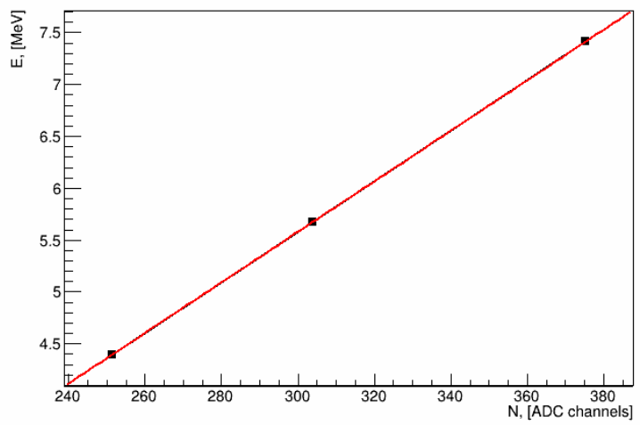

       Figure 4. Calibration points linear approximation

Energy loss approximation models
--------------------------------

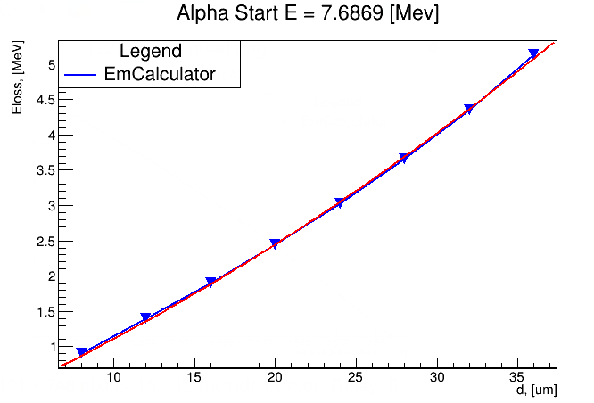

       Figure 5. :math:`dE(d)` quadratic approximation. Start energy 7.6869 [MeV]

Program realization
===================

The realization of algorithms is implemented as ROOT-macro. The input data is a file with raw data in a *.root format, produced by FLNR *.lmd life conversion library based on TNeEvent class using the Go4 system developed in GSI.

Class diagram
-------------

The class diagram (figure 6) briefly presents relations between main program entities.

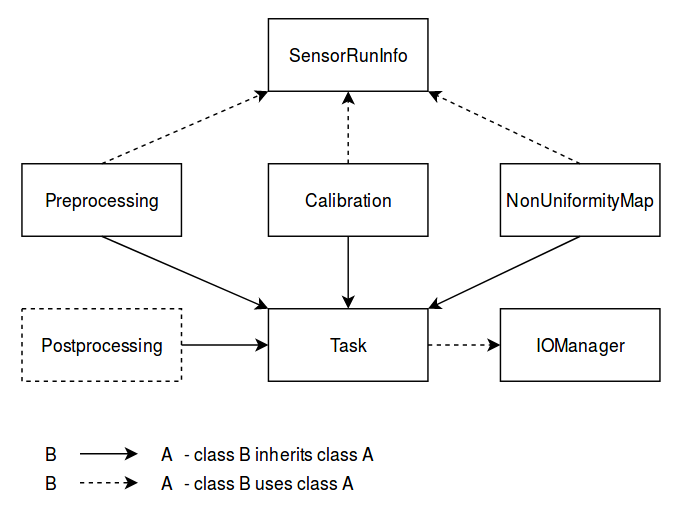

       Figure 6. Class diagram

An Execution of a calibration macro produces results in the following folder structure 

::
    results
    ├── [FILE_NAME]
        ├── [SENSOR_NAME]
            ├── preview
            ├── calibration
            ├── results
            report_[FILE_NAME]_[SENSOR_NAME].txt

[FILE_NAME] - base name of a raw input file.
[FILE_NAME] - leaf name of a target sensor.

Preprocessing
-------------

The preprocessing is intended to clear input data for calibration and preview of histograms for choosing calibration algorithm parameters.

.. code-block:: c

  auto ssd_1m_1 = new SensorRunInfo("SSD_1m_1", 16, fileName, treeName, branchName);
  auto prep_ssd_1m_1 = new SensorPreprocessing(ssd_1m_1);
  prep_ssd_1m_1->PreviewRawData();
  prep_ssd_1m_1->FindThresholds("draw_on"); // finds noise threshold and draw markers on plot
  prep_ssd_1m_1->MultiplicitySelection("draw_on"); // makes multiplicity equals one for each event

Solver
------

Solver is a `Calibration` class entity.

.. code-block:: c

    auto calib_ssd_1m_1 = new Calibration(ssd_1m_1);
    // TSpectrum settings

Set energy loss approximation models
^^^^^^^^^^^^^^^^^^^^^^^^^^^^^^^^^^^^

The energy loss approximation model switch between Geant and LISE++ is set in Exec() method

.. code-block:: c
    calib_ssd_1m_1->Exec("lise_approx");

or

.. code-block:: c
    calib_ssd_1m_1->Exec("geant_approx");

.. _set-peak-search-algorithm-type

Set peak search algorithm type
^^^^^^^^^^^^^^^^^^^^^^^^^^^^^^

Two peak search algorithms are implemented: 

* 'Sliding window' - a window of fixed width is slides left-to-right in the bounded region around peaks found by TSpectrum algorithm.
* Gauss - fit bu Gauss with pol1 in fixed width around peaks found by TSpectrum algorithm.

    // Common peak search parameter
    calib_ssd_1m_1->SetFitMinSigma(6.);
    calib_ssd_1m_1->SetFitPeakThreshold(0.7);
    // Sliding window settings
    calib_ssd_1m_1->SetPeakSearchMethod("SLIDING_WINDOW");
    calib_ssd_1m_1->SetIdentifyWindWidth(w);
    calib_ssd_1m_1->SetSearchRegionWidth(2*w);
    // Gauss search settings
    calib_ssd_1m_1->SetPeakWidth(30);
    // Choose the method
    calib_ssd_1m_1->SetPeakSearchMethod("SLIDING_WINDOW");
    // or
    //calib_ssd_1m_1->SetPeakSearchMethod('GAUSS');

Postprocessing
--------------

For now, the postprocessing is not implemented as class. User can validate results by reading the report file and viewing calibrated spectra. 

The drawing of 

.. code-block:: c

    calib_ssd->DrawCalibratedSpetra();

In the future, the postprocessing class may realize the handling of several run results to obtain comprehensive sensor analysis with different measurements.

Data processing flow
====================

The full processing flow of calibration run data from readout to reconstruction verification is shown in the figure 7.

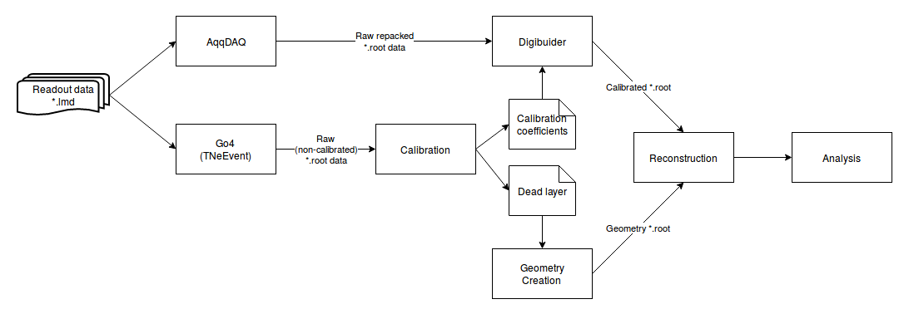

       Figure 7. Data processing flow

* AqqDAQ files for raw data conversion are available by link `ACCULINNA_go4_user_library <https://github.com/evovch/ACCULINNA_go4_user_library>`_ .

* Full calibration run example `ExpertRoot SSD calibration <https://github.com/ExpertRootGroup/er/tree/443_SiDetecrorCalibration/macro/ssd_calibration>`_.

* Digibuilding, reconctruction and analysis example `ExpertRoot SSD reconstruction <https://github.com/ExpertRootGroup/er/tree/_2sensors_reco/macro/QA/QTelescope/RecoOnCalibSource/exp1904/thin_and_thick>`_

Verification
============

Ionization models comparison
----------------------------

The following tables demonstrate difference between energy losses estimations evaluated by LISE++ program and Geant4 G4EmCalulator class. Dependencies listed in tables 2-4 are fitted by quadratic line. The approximation example is shown in the figure 5 for 7.6869 [MeV] start energy.

Table 2. Start energy - 4.7844 [MeV]. :math:`dE(d)` dependence evaluated by Geant G4EmCalculator and LISE++.

+-------------------+---------------+-------------+
| :math:'d', [|um|] | Geant4, [MeV] | LISE, [MeV] |
+===================+===============+=============+
| 2                 | 0.302624      | 0.30463     |
+-------------------+---------------+-------------+
| 4                 | 0.617213      | 0.62423     |
+-------------------+---------------+-------------+
| 6                 | 0.947968      | 0.95791     |
+-------------------+---------------+-------------+
| 8                 | 1.296340      | 1.30900     |
+-------------------+---------------+-------------+
| 12                | 2.059860      | 2.08110     |
+-------------------+---------------+-------------+
| 16                | 2.960110      | 2.99460     |
+-------------------+---------------+-------------+
| 20                | 4.130310      | 4.18250     |
+-------------------+---------------+-------------+

Table 3. Start energy - 6.0024 [MeV]. :math:`dE(d)` dependence evaluated by Geant G4EmCalculator and LISE++.

+-------------------+---------------+-------------+
| :math:'d', [|um|] | Geant4, [MeV] | LISE, [MeV] |
+===================+===============+=============+
| 2                 | 0.260404      | 0.25998     |
+-------------------+---------------+-------------+
| 4                 | 0.527759      | 0.53050     |
+-------------------+---------------+-------------+
| 6                 | 0.804738      | 0.81157     |
+-------------------+---------------+-------------+
| 8                 | 1.091380      | 1.10100     |
+-------------------+---------------+-------------+
| 12                | 1.697650      | 1.71350     |
+-------------------+---------------+-------------+
| 16                | 2.362070      | 2.38580     |
+-------------------+---------------+-------------+
| 20                | 3.104160      | 3.13770     |
+-------------------+---------------+-------------+
| 24                | 3.968630      | 4.01680     |
+-------------------+---------------+-------------+
| 28                | 5.057970      | 5.13250     |
+-------------------+---------------+-------------+
 
Table 4. Start energy - 7.6869 [MeV]. :math:`dE(d)` dependence evaluated by Geant G4EmCalculator and LISE++.

+-------------------+---------------+-------------+
| :math:'d', [|um|] | Geant4, [MeV] | LISE, [MeV] |
+===================+===============+=============+
| 2                 | 0.219688      | 0.22259     |
+-------------------+---------------+-------------+
| 4                 | 0.443058      | 0.45036     |
+-------------------+---------------+-------------+
| 6                 | 0.671984      | 0.68333     |
+-------------------+---------------+-------------+
| 8                 | 0.906041      | 0.91841     |
+-------------------+---------------+-------------+
| 12                | 1.390340      | 1.41010     |
+-------------------+---------------+-------------+
| 16                | 1.901590      | 1.92640     |
+-------------------+---------------+-------------+
| 20                | 2.443090      | 2.47640     |
+-------------------+---------------+-------------+
| 24                | 3.023700      | 3.06320     |
+-------------------+---------------+-------------+
| 28                | 3.651830      | 3.70330     |
+-------------------+---------------+-------------+
| 32                | 4.344540      | 4.40770     |
+-------------------+---------------+-------------+
| 36                | 5.131450      | 5.21050     |
+-------------------+---------------+-------------+
| 40                | 6.068520      | 6.17800     |
+-------------------+---------------+-------------+

.. _calibration-stability-research

Calibration stability research
------------------------------

Stability in time
^^^^^^^^^^^^^^^^^

On/off stability
^^^^^^^^^^^^^^^^

Reconstruction
--------------

Parameters of

Table 5. SSD_1m_1 thick sensor calibration results

+--------------+------------+-----------+---------------------+
| Strip number | a          | b         | :math:`d`, [|um|]   |
+==============+============+===========+=====================+
| 0            | 0.0170136  | -0.300991 | 2.14751             |
+--------------+------------+-----------+---------------------+
| 1            | 0.0169033  | -0.377671 | 2.40688             |
+--------------+------------+-----------+---------------------+
| 2            | 0.0167126  | -0.293483 | 2.48719             |
+--------------+------------+-----------+---------------------+
| 3            | 0.0165496  | -0.378723 | 2.70073             |
+--------------+------------+-----------+---------------------+
| 4            | 0.016702   | -0.38993  | 2.39342             |
+--------------+------------+-----------+---------------------+
| 5            | 0.0166474  | -0.39643  | 2.67955             |
+--------------+------------+-----------+---------------------+
| 6            | 0.0168437  | -0.35558  | 2.74014             |
+--------------+------------+-----------+---------------------+
| 7            | 0.016479   | -0.273754 | 2.23416             |
+--------------+------------+-----------+---------------------+
| 8            | 0.0167534  | -0.431799 | 2.53741             |
+--------------+------------+-----------+---------------------+
| 9            | 0.0169682  | -0.269916 | 1.80624             |
+--------------+------------+-----------+---------------------+
| 10           | 0.0170281  | -0.290404 | 2.32398             |
+--------------+------------+-----------+---------------------+
| 11           | 0.0171464  | -0.28802  | 2.30622             |
+--------------+------------+-----------+---------------------+
| 12           | 0.0170073  | -0.303184 | 2.28047             |
+--------------+------------+-----------+---------------------+
| 13           | 0.0171004  | -0.268635 | 1.9785              |
+--------------+------------+-----------+---------------------+
| 14           | 0.0167947  | -0.351776 | 2.44018             |
+--------------+------------+-----------+---------------------+
| 15           | 0.0164761  | -0.350187 | 1.83882             |
+--------------+------------+-----------+---------------------+
|              |            | Avg.      | 2.33134             |
+--------------+------------+-----------+---------------------+

Table 5. SSD_20u_1 thin sensor calibration results.
+--------------+------------+------------+---------------------+
| Strip number | a          | b          | :math:`d`, [|um|]   |
+==============+============+============+=====================+
| 0            | 0.00508681 | -0.11839   | 2.11252             |
+--------------+------------+------------+---------------------+
| 1            | 0.00507884 | -0.112467  | 2.10424             |
+--------------+------------+------------+---------------------+
| 2            | 0.00520404 | -0.116742  | 2.05644             |
+--------------+------------+------------+---------------------+
| 3            | 0.00510507 | -0.0809549 | 2.11519             |
+--------------+------------+------------+---------------------+
| 4            | 0.00521461 | -0.109044  | 1.98992             |
+--------------+------------+------------+---------------------+
| 5            | 0.0051204  | -0.0892601 | 2.10055             |
+--------------+------------+------------+---------------------+
| 6            | 0.00511517 | -0.109871  | 2.10648             |
+--------------+------------+------------+---------------------+
| 7            | 0.00506191 | -0.0841183 | 1.93686             |
+--------------+------------+------------+---------------------+
| 8            | 0.00512354 | -0.0867048 | 2.20535             |
+--------------+------------+------------+---------------------+
| 9            | 0.00511479 | -0.0644811 | 2.3923              |
+--------------+------------+------------+---------------------+
| 10           | 0.00519145 | -0.0966503 | 2.59457             |
+--------------+------------+------------+---------------------+
| 11           | 0.00517657 | -0.0799033 | 2.14259             |
+--------------+------------+------------+---------------------+
| 12           | 0.00512621 | -0.0975369 | 2.16496             |
+--------------+------------+------------+---------------------+
| 13           | 0.0052136  | -0.0672926 | 2.2285              |
+--------------+------------+------------+---------------------+
| 14           | 0.00517104 | -0.0885697 | 1.91963             |
+--------------+------------+------------+---------------------+
| 15           | 0.00521849 | -0.0544258 | 2.17915             |
+--------------+------------+------------+---------------------+
|              |            | Avg.       | 2.14683             |
+--------------+------------+------------+---------------------+

The source |Ra226| was set in 65 degrees with respect to the sensor's normal so effective thickness (2.14 |um|) should be recalculated to real (0.78 |um|). In the front and backside of the sensor, the thickness is expected equal.

In independent exploration dead layer on source was estimated by value 0.3 |um|.

One sensor
^^^^^^^^^^

The reconstruction result for single thick detector is shown in figures 8-10. One can notice that difference from origin spectrum values (4.7844, 6.0024 and 7.6869 MeV) is less than 1 KeV.

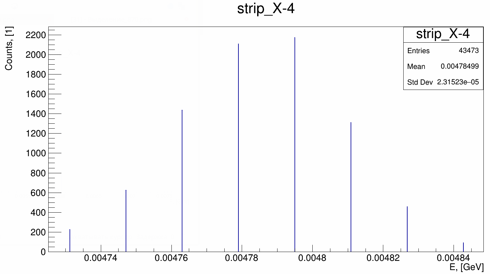

       Figure 8. Reconstructed spectrum for the single thick sensor. Source passport energy 4.7844 MeV

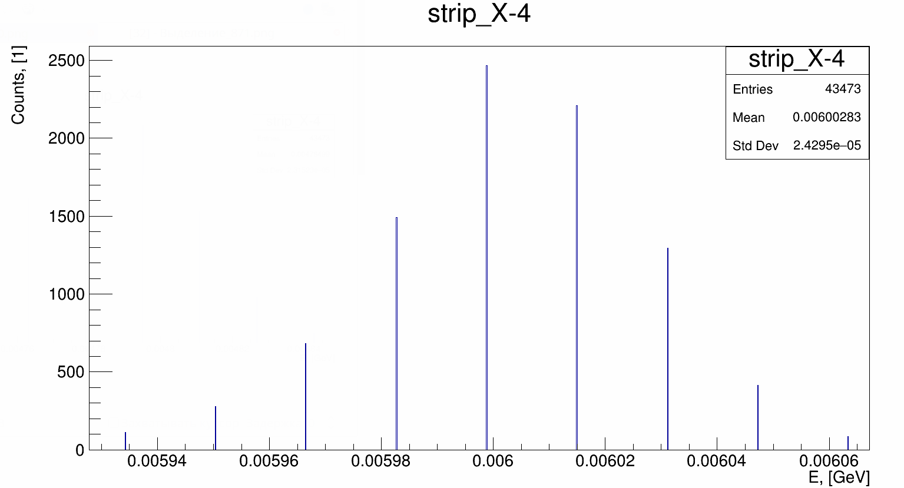

       Figure 9. Reconstructed spectrum for the single thick sensor. Source passport energy 6.0024 MeV

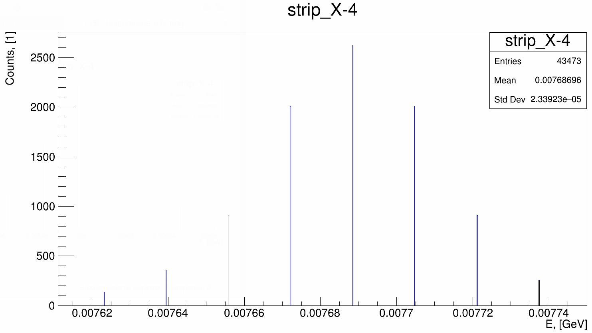

       Figure 10. Reconstructed spectrum for the single thick sensor. Source passport energy 7.6869 MeV

Two sensors
^^^^^^^^^^^

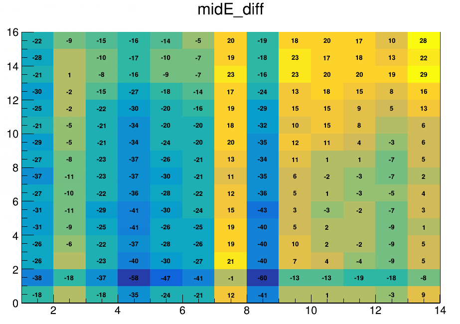

       Figure 11. Map of difference between origin and reconstructed energies. Source passport energy 6.0024 MeV

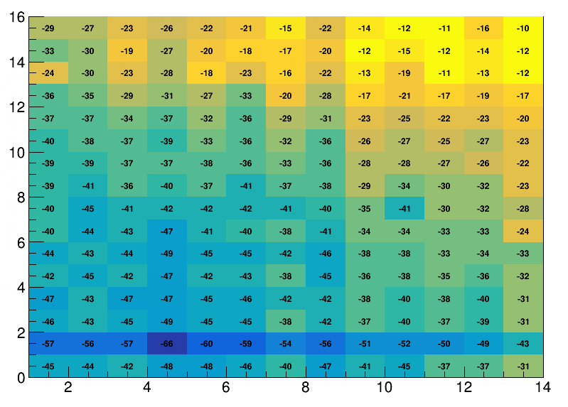

       Figure 12. Map of difference between origin and reconstructed energies. Source passport energy 7.6869 MeV

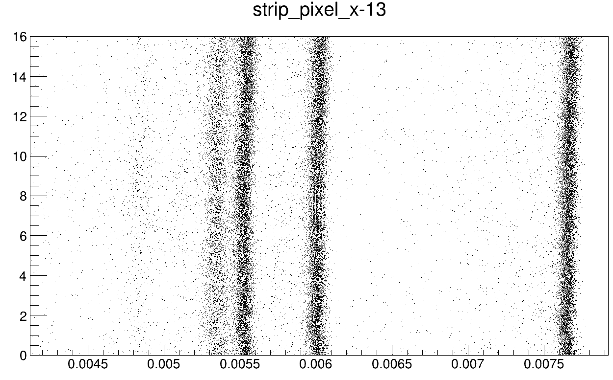

       Figure 13. Example of a spectrum reconstruction in pixels of 13th X-strip

