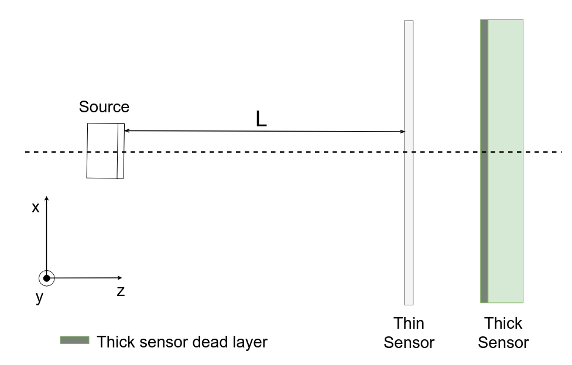
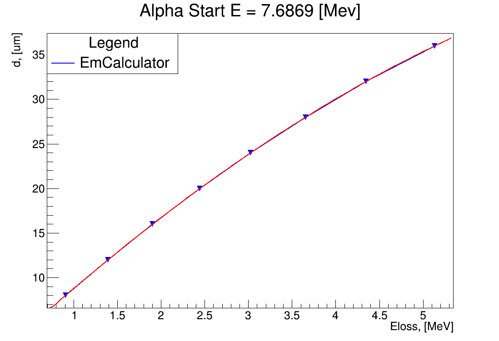
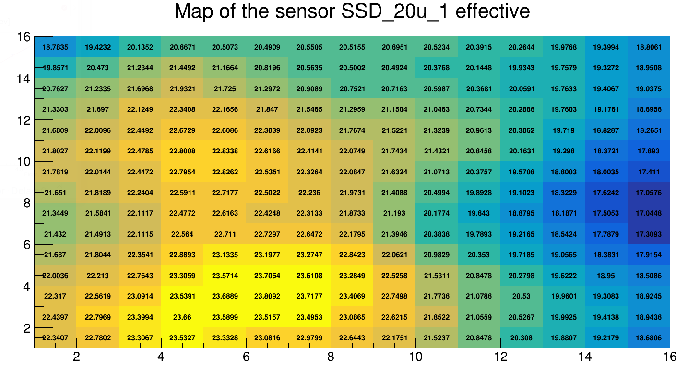

.. |Ra226| replace:: \ :sub:`226`\ Ra
.. |alpha| replace:: :math:`\alpha`
.. |um| replace:: :math:`\mu m`

**********************************
Silicon strip detector calibration
**********************************

This section contains description of the Silicon Strip Detector (SSD) calibration using |Ra226| alpha particle source.

.. contents:: Sections
   :local:
   :backlinks: top

Calibration algorithm
=====================

General assumptions
-------------------

The main assumptions the method is based:

#. Detector and readout system responses are linear

.. math::

   E = aN + b,

where :math:`E` - energy in [eV] dimensionality, :math:`N` - readout value in ADC-channels count dimensionality, :math:`a` and :math:`b` - calibration coefficients;

#. Dead layer is uniform;
#. G4EmStandardPhysics description of |alpha|-particle energy losses in silicon is sufficient;
#. All |alpha|-particles are stopped in the detector.

Dead layer thickness estimation 
-------------------------------

|Ra226| |alpha|-particles source enables to perform calibration measures with several energies. In the under discussion method three lines are used :math:`E_1 = 4.7844` [MeV],  :math:`E_2 = 6.0024` [MeV], :math:`E_3 = 7.6869` [MeV].

Ionization losses depend on particle start energy and dead layer thickness which it passes through.

For the set of three spectrum lines, an energy losses of lines dependence on dead layer thickness can be characterized by the following dimensionless expression

.. math::

   \eta(d) = \dfrac{N_3 - N_2}{N_3 - N_1},

where :math:`N_1, N_2, N_3` - peak positions of spectrum lines in ADC-channel counts, coincident with :math:`E_1, E_2, E_3` energies in [MeV], and in linear calibration assumption it equals

.. math::

   \eta(d) = \dfrac{E_3 - E_2}{E_3 - E_1},

The figure 1 shows :math:`\eta(d)` dependence (in silicon equivalent of thickness) calculated using Geant4 G4EmCalculator class and program LISE++.

.. figure:: _images/ssd_calib/eta_d_lise_emcalc.png
       :scale: 80 %
       :align: center
       :alt: eta_d_lise_emcalc

       Figure 1. Dependence :math:`d(\eta)`, calculated using G4EmCalculator and LISE++

For the calibration procedure the quadratic approximation of the :math:`d(\eta)` dependence shown in the figure 2 is used.

.. figure:: _images/ssd_calib/d_eta_quad.png
       :scale: 80 %
       :align: center
       :alt: d_eta_quad

       Figure 2. Quadratic approximation of the :math:`d(\eta)` dependence

Approximation coefficients are listed in the table 1.

Table 1. Coefficients of the quadratic approximation :math:`d(\eta)=p_2 \eta^2 + p_1 \eta + p_0`

+-------------+-------------+-------------+
| :math:`p_2` | :math:`p_1` | :math:`p_0` |
+=============+=============+=============+
| 17102.8129  | 19011.5041  | -5272.9763  |
+-------------+-------------+-------------+

The typical form of the spectrum is shown in the figure 3.

.. figure:: _images/ssd_calib/ssd_1m_1_13st_spec.png
       :scale: 80 %
       :align: center
       :alt: ssd_1m_1_13st_spec

       Figure 3. Typical spectrum. Red markers - peaks positions found by TSpectum algorithm

Algorithms of peaks positions determination are described in the section :ref:`_set-peak-search-algorithm-type`. The methodology of algorithm stability exploration is described in the section :ref:`calibration-stability-research`.

An accuracy of peak centroid position (RMS) determination by the 'sliding window' algorithm is about 0.05 ADC sampling step. In case of a large peak width accuracy goes downward. 

The inaccuracy of the dead layer estimation concerned with the peak searching algorithm inaccuracy is 0.24 [|um|] in case of the dead layer thickness about 2 [|um|]. The assumption about strips-wise dead layer uniformity enables to treat each strip dead layer as averaged over the whole sensor. The averaging leads to accuracy in dead layer determination up to 0.06 |um| (RMS). 

The dead layer thickness found in such a way also includes the dead layer of the source cover ~0.3 [|um|].

In the case of a thin detector (about 20 |um|), the full stop of alpha-lines is occurred when the sensor is rotated for a significant angle (65 degrees) with respect to direct source exposure.
An evaluated effective thickness must be re-calculated into real one according to angle.

Calibration coefficients determining
------------------------------------

The estimated dead layer thickness enables to evaluate energy deposit of |alpha|-particles with different energies and calculate corrected readout energy value. Then three points :math:`E(N)` are approximated by a straight line (figure 4).

.. figure:: _images/ssd_calib/calib_line.png
       :scale: 80 %
       :align: center
       :alt: calib_line

       Figure 4. Calibration points linear approximation

Program realization
===================

The realization of algorithms is implemented as ROOT-macro. The input data is a file with raw data in a *.root format, produced by FLNR *.lmd life conversion library based on TNeEvent class using the Go4 system developed in GSI.

All the classes are described in the source code Doxygen documentation.

Calibration tools may be included to a user macro by the following:

.. code-block:: c

  #include "ERCalibrationSSD.cxx"

  using namespace ERCalibrationSSD;
  

Class diagram
-------------

The class diagram (figure 6) briefly presents relations between main program entities.

.. figure:: _images/ssd_calib/class_diagram.png
       :scale: 80 %
       :align: center
       :alt: class_diagram

       Figure 6. Class diagram

`Task` class is the base for all processing methods and aggregates

* `run_id` which is istantiated by a base of a raw input file name.
* `CalibIOManager` class instance which is responsible for a unified access to resulting files. It deploys the folder structure for results

::

  result
  ├── [run_id]
  │   ├── input - preprocessing resulting data.
  │   └── [sensor_name]
  │       ├── txt - text format results, thesholds, peaks position, etc.
  │       ├── draw - ROOT format of results.
  │       └── report_[run_id]_[sensor_name].txt
  └── [run_id]
      ├── input - preprocessing resulting data.
      ├── [sensor_name_thin_sensor_name_thick] - files related to thin sensor thickness map building
      ├── [sensor_name_thin] - thin sensor data
      └── [sensor_name_thick] - thick sensor data

`SensorRunInfo` class stores information about path to the raw data, station name and histogram parameters during the processing.

.. code-block:: c
  // Define input file path with raw data converted by TNEvent go4-based library
  const TString file_calib_path = /path/input.root";
  // [Prepare information about sensor in the calibration run]
  // Constructor parameters: 
  // * sensor branch name in raw data file
  // * stips amount
  // * bins amount in analysis histograms
  // * raw data file path
  //
  auto ssd_1m_1 = new SensorRunInfo("SSD_1m_1", 16, 1024, file_calib_path);
  auto ssd_1m_2 = new SensorRunInfo("SSD_1m_2", 16, 1024, file_calib_path);
  auto ssd_1m_3 = new SensorRunInfo("SSD_1m_3", 16, 1024, file_calib_path);
  auto ssd_1m_4 = new SensorRunInfo("SSD_1m_4", 16, 1024, file_calib_path);

Preprocessing
-------------

The preprocessing is intended to clear input data for the calibration (or thin sensor thickness map) by leaving only analyzed stations leaves in a ROOT tree and preview of histograms for choosing calibration algorithm parameters.

.. code-block:: c

  auto prep_ssd_1m_1 = new Preprocessing(file_calib_path);
  // several sensors may be added
  prep_ssd_1m_1->AddSensor(ssd_1m_1);
  prep_ssd_1m_1->ConvertTree();
  prep_ssd_1m_1->FindThresholds();
  prep_ssd_1m_1->MultiplicitySelection();

Using methods  `ConvertTree()`, `FindThresholds()` and `MultiplicitySelection()` one can control intermediary results (thresholds finding quality), but commands can be executed by the command

.. code-block:: c

  prep_ssd_1m_1->Exec();

Solver
------

Calibration procedure is prosecced by `Calibration` class and includes the following steps.

1) Peaks position determination. 
2) Dead layer estimation. 
3) Calibration coefficients calculation. 
4) Report file printing.

Class constructor in the current reazalion keep path to a raw data file as a parameter.

.. code-block:: c

    auto calib_ssd_1m_1 = new Calibration(file_calib_path);

The report file is stored by path `./result/[run_id]/[sensor_name]/report_[run_id]_[sensor_name].txt`.

.. _set-peak-search-algorithm-type
Set peak search algorithm type
^^^^^^^^^^^^^^^^^^^^^^^^^^^^^^

Two peak search algorithms are implemented: 

* 'Sliding window' (default) - a window of fixed width is slides left-to-right in the bounded region around peaks found by TSpectrum algorithm.
* 'Gauss' - fit bu Gauss with pol1 in fixed region around peaks found by TSpectrum algorithm.

Proper algorithm is set by `SetPeakSearchMethod()` method. Algorithm options and realization details may be found in Doxygen documentation.

.. code-block:: c

    calib_ssd_1m_1->SetPeakSearchMethod("sliding_window");
    // TSpectrum parameters
    calib_ssd_1m_1->SetFitMinSigma(6.);
    calib_ssd_1m_1->SetFitPeakThreshold(0.7);
    // 'Sliding window' parameters
    calib_ssd_1m_1->SetSlideWindowWidth(10);
    calib_ssd_1m_1->SetSearchRadius(15);

or

.. code-block:: c

    calib_ssd_1m_1->SetPeakSearchMethod("gauss");
    // TSpectrum parameters
    calib_ssd_1m_1->SetFitMinSigma(6.);
    calib_ssd_1m_1->SetFitPeakThreshold(0.7);
    // Gaus + pol1 parameter
    calib_ssd_1m_1->SetSearchRadius(15);

Postprocessing
--------------

For now, the postprocessing is not implemented as a special utility. User can validate results by viewing the report file and the calibrated spectra.

Data processing flow
====================

The full processing flow of calibration run data from readout to reconstruction verification is shown in the figure 7.

.. figure:: _images/ssd_calib/data_flow.png
       :scale: 80 %
       :align: center
       :alt: data_flow

       Figure 7. Data processing flow

* AqqDAQ files for raw data conversion are available by link `ACCULINNA_go4_user_library <https://github.com/evovch/ACCULINNA_go4_user_library>`_.

* Full calibration run example `ExpertRoot SSD calibration <https://github.com/ExpertRootGroup/er/tree/443_SiDetecrorCalibration/macro/ssd_calibration>`_.

* Digibuilding, reconstruction and analysis example `ExpertRoot SSD reconstruction <https://github.com/ExpertRootGroup/er/tree/_2sensors_reco/macro/QA/QTelescope/RecoOnCalibSource/exp1904/thin_and_thick>`_

LMD data conversion
-------------------

TNeEvent library
^^^^^^^^^^^^^^^^
TNeEvent is nominal name for a event library prepared for a certain experiment run.
Library files `libGo4UserAnalysis.rootmap` and `libGo4UserAnalysis.so` should be in folder invoking Go4 library execution.

Before conversion, environment variables must be initialized by the execution of the go4login script from the Go4 library install location.

.. code-block:: bash

  bash /path/go4login

All the *lmd files from `dir_in` may be converted to *.root files to `dir_out` by the following bash-script.

.. code-block:: bash

  dir_in=/path/to/input/dir/
  dir_out=/path/to/output/dir/
  for file in dir*
  do
  fbname=$(basename "$file" .lmd)
  if [ -f "$file" ]
  then
  go4analysis -file $file -store "{$dir_out}{$fbname}.root"
  fi
  done

AqqDAQ + Digibuilder
^^^^^^^^^^^^^^^^^^^^
The first step is repacking *lmd data to *root by AqqDAQ utilities. All the instructions on `ACCULINNA_go4_user_library <https://github.com/evovch/ACCULINNA_go4_user_library>`_.

The Digibuilder is set of ExpertRoot classes. Example of it's usage in the context of event reconstruction in thin sensor map building run may be found by the `link <https://github.com/ExpertRootGroup/er/blob/_2sensors_reco/macro/QA/QTelescope/RecoOnCalibSource/exp1904/thin_and_thick/digibuilder_postclbEXP1904.C>`_.

Thickness map of the thin sensor 
================================

A thin sensor effective thickness is not uniform. It can be defined using data from the measurement with simultaneous radiation exposure of an assembly of a thick sensor and a thin in the front of it shown in Figure 8.

       Figure 8. Thin and thick sensors radiation exposure

In such measurement only the high energy line comes throught thin sensor and registered in thick, so it is used for calibration.

An energy deposit in the thin station with respect to linear calibration assumption for each pixel (data registered on cross of two strips: one from thin station and another from thin) may be estimated by expression:

.. math::

   \Delta E = a(N_2 - N_1),

:math:`N_2` and :math:`N_1` - readout value  from run with thick and thin sensors and with thick only respectively, :math:`a` - calibration coefficient.

The full effective thickness including both thin sensor and dead layer depending on energy deposit is evaluated by qubic shown in figure 9.

       Figure 9. Qubic approximation of d(\Delta E)

The fit coefficients are listed in table 2.

Table 2. Coefficients of the quadratic approximation 
:math:`d(\Delta E)=p_3 \Delta E^3 + p_2 \Delta E^2 + p_1 \Delta E + p_0`

+-------------+-------------+-------------+-------------+
| :math:`p_3` | :math:`p_2` | :math:`p_1` |  :math:`p_0`|
+=============+=============+=============+=============+
| -0.0044059  | 0.00805579  |   9.18781   | -0.401229   |
+-------------+-------------+-------------+-------------+

The last step is subtracting of the thick sensor dead layer:

.. math::

   d_thin = d_full - d_dead,

where d_thin - thin sensor effective thickness, d_full - full thickness, d_dead - thick sensor dead layer thickness.

Code example. Thin sensor thickness map buildind 
------------------------------------------------

The `NonUniformityMapBuilder` class inherits `Task` class and inplements thin sensor thickness distribution calculation.
It handles information about two stations and needs preliminary steps: thick sensor calibration, map building run data preprocessing.

.. code-block:: c

  const TString calib_run_path = "/thick_calib_path/file.root";
  const TString map_run_path = "/map_path/file.root";
  // Define run parameters
  auto ssd_1m_1_cal = new SensorRunInfo("SSD_1m_1", 16, 1024, calib_run_path);
  auto ssd_1m_1_map = new SensorRunInfo("SSD_1m_1", 16, 1024, map_run_path);
  auto ssd_20u_1_map = new SensorRunInfo("SSD_20u_1", 16, 1024, map_run_path);
  
  auto thickness_map = new NonUniformityMapBuilder(map_run_path);
  // Set sensors parameters
  thickness_map->SetThickSensor(ssd_1m_1_map);
  thickness_map->SetThinSensor(ssd_20u_1_map);
  thickness_map->SetThickCalibSensor(ssd_1m_1_cal);
  // Set peak search algorithm parameters
  thickness_map->SetPeakSearchMethod("sliding_window");
  thickness_map->SetFitMinSigma(6.);
  thickness_map->SetFitPeakThreshold(0.7);
  thickness_map->SetSlideWindowWidth(10);
  thickness_map->SetSearchRadius(15);
  // Run map builder
  thickness_map->Exec();

Resulting files are stored in text format in a `./result/[run_id]/[map_sensors_id]/txt/map_[...].txt` and ROOT histogram `./result/[run_id]/[map_sensors_id]/draw/map_[...].root`. The histogram is shown in figure 10.

       Figure 9. Thin sensor map ROOT file example

Verification
============

Ionization models comparison
----------------------------

The following tables demonstrate difference between energy losses estimations evaluated by LISE++ program and Geant4 G4EmCalulator class. Dependencies listed in tables 3-5 are fitted by quadratic line. The approximation example is shown in the figure 5 for 7.6869 [MeV] start energy.

Table 3. Start energy - 4.7844 [MeV]. :math:`dE(d)` dependence evaluated by Geant G4EmCalculator and LISE++.

+-------------------+---------------+-------------+
| :math:`d`, [|um|] | Geant4, [MeV] | LISE, [MeV] |
+===================+===============+=============+
| 2                 | 0.302624      | 0.30463     |
+-------------------+---------------+-------------+
| 4                 | 0.617213      | 0.62423     |
+-------------------+---------------+-------------+
| 6                 | 0.947968      | 0.95791     |
+-------------------+---------------+-------------+
| 8                 | 1.296340      | 1.30900     |
+-------------------+---------------+-------------+
| 12                | 2.059860      | 2.08110     |
+-------------------+---------------+-------------+
| 16                | 2.960110      | 2.99460     |
+-------------------+---------------+-------------+
| 20                | 4.130310      | 4.18250     |
+-------------------+---------------+-------------+

Table 4. Start energy - 6.0024 [MeV]. :math:`dE(d)` dependence evaluated by Geant G4EmCalculator and LISE++.

+-------------------+---------------+-------------+
| :math:`d`, [|um|] | Geant4, [MeV] | LISE, [MeV] |
+===================+===============+=============+
| 2                 | 0.260404      | 0.25998     |
+-------------------+---------------+-------------+
| 4                 | 0.527759      | 0.53050     |
+-------------------+---------------+-------------+
| 6                 | 0.804738      | 0.81157     |
+-------------------+---------------+-------------+
| 8                 | 1.091380      | 1.10100     |
+-------------------+---------------+-------------+
| 12                | 1.697650      | 1.71350     |
+-------------------+---------------+-------------+
| 16                | 2.362070      | 2.38580     |
+-------------------+---------------+-------------+
| 20                | 3.104160      | 3.13770     |
+-------------------+---------------+-------------+
| 24                | 3.968630      | 4.01680     |
+-------------------+---------------+-------------+
| 28                | 5.057970      | 5.13250     |
+-------------------+---------------+-------------+
 
Table 5. Start energy - 7.6869 [MeV]. :math:`dE(d)` dependence evaluated by Geant G4EmCalculator and LISE++.

+-------------------+---------------+-------------+
| :math:`d`, [|um|] | Geant4, [MeV] | LISE, [MeV] |
+===================+===============+=============+
| 2                 | 0.219688      | 0.22259     |
+-------------------+---------------+-------------+
| 4                 | 0.443058      | 0.45036     |
+-------------------+---------------+-------------+
| 6                 | 0.671984      | 0.68333     |
+-------------------+---------------+-------------+
| 8                 | 0.906041      | 0.91841     |
+-------------------+---------------+-------------+
| 12                | 1.390340      | 1.41010     |
+-------------------+---------------+-------------+
| 16                | 1.901590      | 1.92640     |
+-------------------+---------------+-------------+
| 20                | 2.443090      | 2.47640     |
+-------------------+---------------+-------------+
| 24                | 3.023700      | 3.06320     |
+-------------------+---------------+-------------+
| 28                | 3.651830      | 3.70330     |
+-------------------+---------------+-------------+
| 32                | 4.344540      | 4.40770     |
+-------------------+---------------+-------------+
| 36                | 5.131450      | 5.21050     |
+-------------------+---------------+-------------+
| 40                | 6.068520      | 6.17800     |
+-------------------+---------------+-------------+

.. _calibration-stability-research

Calibration stability research
------------------------------

Stability in time
^^^^^^^^^^^^^^^^^

The calibration stability in time was checked in long runs enabling divide full statistics into several files.
Maximal standart deviations of calibration coefficients are shown in table 6 and demonstrate good stability.

Table 6. Maxumal standard devaitions of calibration coefficinets in time

+--------------+-----------------+-----------------+
| Sensor       | :math:`sigma_a` | :math:`sigma_b` |
+==============+=================+=================+
| Thin         |      5.5e-5     |     0.016       |
+--------------+-----------------+-----------------+
| Thick        |      6.5e-6     |    0.0059       |
+--------------+-----------------+-----------------+

On/off stability
^^^^^^^^^^^^^^^^

Turn-off the sensor and remeasurement shows significant inaccuracy in peak positions: up to 9 discrete steps.
This result speaks that there good reasons to do calibrations without sensors turning off and opening the experimental camera.

Reconstruction
--------------

Calibration parameters used in the reconstruction validation are listed in tables 7-8.

Table 7. SSD_1m_1 thick sensor calibration results

+--------------+------------+-----------+---------------------+
| Strip number | a          | b         | :math:`d`, [|um|]   |
+==============+============+===========+=====================+
| 0            | 0.0170136  | -0.300991 | 2.14751             |
+--------------+------------+-----------+---------------------+
| 1            | 0.0169033  | -0.377671 | 2.40688             |
+--------------+------------+-----------+---------------------+
| 2            | 0.0167126  | -0.293483 | 2.48719             |
+--------------+------------+-----------+---------------------+
| 3            | 0.0165496  | -0.378723 | 2.70073             |
+--------------+------------+-----------+---------------------+
| 4            | 0.016702   | -0.38993  | 2.39342             |
+--------------+------------+-----------+---------------------+
| 5            | 0.0166474  | -0.39643  | 2.67955             |
+--------------+------------+-----------+---------------------+
| 6            | 0.0168437  | -0.35558  | 2.74014             |
+--------------+------------+-----------+---------------------+
| 7            | 0.016479   | -0.273754 | 2.23416             |
+--------------+------------+-----------+---------------------+
| 8            | 0.0167534  | -0.431799 | 2.53741             |
+--------------+------------+-----------+---------------------+
| 9            | 0.0169682  | -0.269916 | 1.80624             |
+--------------+------------+-----------+---------------------+
| 10           | 0.0170281  | -0.290404 | 2.32398             |
+--------------+------------+-----------+---------------------+
| 11           | 0.0171464  | -0.28802  | 2.30622             |
+--------------+------------+-----------+---------------------+
| 12           | 0.0170073  | -0.303184 | 2.28047             |
+--------------+------------+-----------+---------------------+
| 13           | 0.0171004  | -0.268635 | 1.9785              |
+--------------+------------+-----------+---------------------+
| 14           | 0.0167947  | -0.351776 | 2.44018             |
+--------------+------------+-----------+---------------------+
| 15           | 0.0164761  | -0.350187 | 1.83882             |
+--------------+------------+-----------+---------------------+
|              |            | Avg.      | 2.33134             |
+--------------+------------+-----------+---------------------+

Table 8. SSD_20u_1 thin sensor calibration results.

+--------------+------------+------------+---------------------+
| Strip number | a          | b          | :math:`d`, [|um|]   |
+==============+============+============+=====================+
| 0            | 0.00508681 | -0.11839   | 2.11252             |
+--------------+------------+------------+---------------------+
| 1            | 0.00507884 | -0.112467  | 2.10424             |
+--------------+------------+------------+---------------------+
| 2            | 0.00520404 | -0.116742  | 2.05644             |
+--------------+------------+------------+---------------------+
| 3            | 0.00510507 | -0.0809549 | 2.11519             |
+--------------+------------+------------+---------------------+
| 4            | 0.00521461 | -0.109044  | 1.98992             |
+--------------+------------+------------+---------------------+
| 5            | 0.0051204  | -0.0892601 | 2.10055             |
+--------------+------------+------------+---------------------+
| 6            | 0.00511517 | -0.109871  | 2.10648             |
+--------------+------------+------------+---------------------+
| 7            | 0.00506191 | -0.0841183 | 1.93686             |
+--------------+------------+------------+---------------------+
| 8            | 0.00512354 | -0.0867048 | 2.20535             |
+--------------+------------+------------+---------------------+
| 9            | 0.00511479 | -0.0644811 | 2.3923              |
+--------------+------------+------------+---------------------+
| 10           | 0.00519145 | -0.0966503 | 2.59457             |
+--------------+------------+------------+---------------------+
| 11           | 0.00517657 | -0.0799033 | 2.14259             |
+--------------+------------+------------+---------------------+
| 12           | 0.00512621 | -0.0975369 | 2.16496             |
+--------------+------------+------------+---------------------+
| 13           | 0.0052136  | -0.0672926 | 2.2285              |
+--------------+------------+------------+---------------------+
| 14           | 0.00517104 | -0.0885697 | 1.91963             |
+--------------+------------+------------+---------------------+
| 15           | 0.00521849 | -0.0544258 | 2.17915             |
+--------------+------------+------------+---------------------+
|              |            | Avg.       | 2.14683             |
+--------------+------------+------------+---------------------+

The source |Ra226| was set in 65 degrees with respect to the sensor's normal so effective thickness (2.14 |um|) should be recalculated to real (0.78 |um|). In the front and backside of the sensor, the thickness is expected equal.

In independent exploration dead layer on source was estimated by value 0.3 |um|.

One sensor
^^^^^^^^^^

The reconstruction result for single thick detector is shown in figures 8-10. One can notice that difference from origin spectrum values (4.7844, 6.0024 and 7.6869 MeV) is less than 1 KeV.

.. figure:: _images/ssd_calib/reco_single_low_E.png
       :scale: 80 %
       :align: center
       :alt: reco_single_low_E

       Figure 11. Reconstructed spectrum for the single thick sensor. Source passport energy 4.7844 MeV

.. figure:: _images/ssd_calib/reco_single_mid_E.png
       :scale: 80 %
       :align: center
       :alt: reco_single_mid_E

       Figure 12. Reconstructed spectrum for the single thick sensor. Source passport energy 6.0024 MeV

.. figure:: _images/ssd_calib/reco_single_high_E.png
       :scale: 80 %
       :align: center
       :alt: reco_single_high_E

       Figure 13. Reconstructed spectrum for the single thick sensor. Source passport energy 7.6869 MeV

Two sensors
^^^^^^^^^^^

